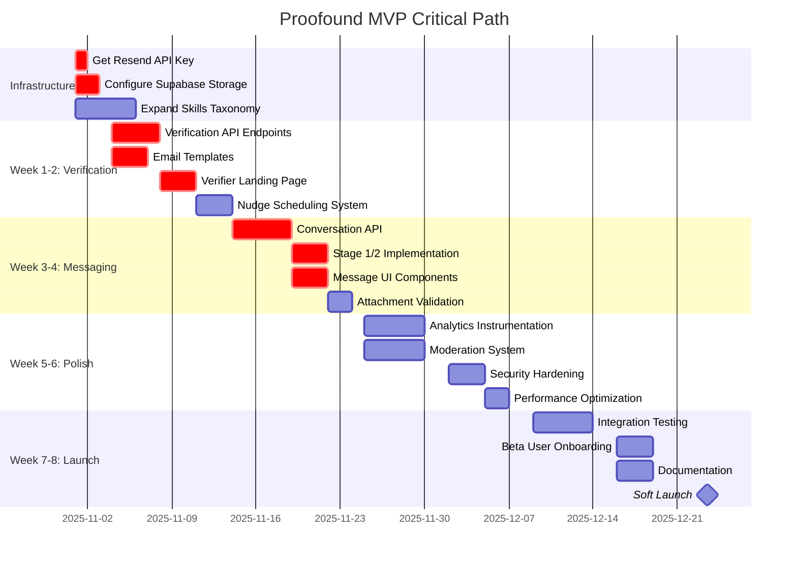

# PROOFOUND MVP IMPLEMENTATION PLAN

**Document Version**: 1.0
**Target Launch Date**: 8-10 weeks from start (1 FTE) | 4-5 weeks (2 FTEs)
**Last Updated**: 2025-10-30
**Status**: Ready for Execution

---

## EXECUTIVE SUMMARY

This document provides a complete, actionable roadmap to launch Proofound MVP based on the audit findings and PRD requirements.

### MVP Definition

**What's IN:**
✅ Proof-based matching with explainability
✅ Email/password + Google/LinkedIn OAuth
✅ Verification workflow (email-based)
✅ Post-match messaging (Stage 1/2 reveal)
✅ Basic moderation (human queue)
✅ Core analytics tracking
✅ File upload for proofs (≤5MB)
✅ ~500 skills taxonomy

**What's OUT (Post-MVP):**
❌ Vector search / semantic matching
❌ AI-powered moderation
❌ Advanced analytics dashboard
❌ 10,000+ skills taxonomy
❌ Mobile apps
❌ MFA, SSO/SAML
❌ Payment processing
❌ Video calls

### Success Criteria (Exit from Beta)

Per PRD Section 10:
- ✅ ≥50% assignments have ≥3 qualified matches in 7d
- ✅ Match acceptance rate ≥20%
- ✅ Report rate <1% with <24h resolution SLA
- ✅ System SLOs met for 30 days
- ✅ Sustained target metrics for 4 weeks

---

## TABLE OF CONTENTS

1. [Current State](#1-current-state)
2. [Critical Path](#2-critical-path-to-mvp)
3. [Week-by-Week Plan](#3-week-by-week-implementation-plan)
4. [System Implementation Guides](#4-system-implementation-guides)
5. [Testing & QA](#5-testing--qa-strategy)
6. [Deployment & DevOps](#6-deployment--devops)
7. [Launch Checklist](#7-launch-checklist)
8. [Post-Launch Plan](#8-post-launch-plan-first-30-days)
9. [Resource Requirements](#9-resource-requirements)
10. [Risk Mitigation](#10-risk-mitigation)

---

## 1. CURRENT STATE

### What's Complete ✅

| System | Status | Notes |
|--------|--------|-------|
| **Database Schema** | 100% | All 30+ tables created with RLS |
| **Authentication** | 90% | Email + OAuth working, missing MFA (post-MVP) |
| **Profile System** | 85% | CRUD complete, missing file upload |
| **Organization Management** | 85% | Core flows working |
| **Matching Algorithm** | 60% | Works but needs enhancements |
| **UI Components** | 80% | Radix UI + Tailwind, needs polish |
| **Email Infrastructure** | 80% | Resend integrated, needs templates |

### What's Missing ❌

| System | Status | Impact | Priority |
|--------|--------|--------|----------|
| **Verification System** | 0% | 🔴 Critical | P0 |
| **Messaging System** | 0% | 🔴 Critical | P0 |
| **File Storage** | 0% | 🟡 High | P1 |
| **Analytics Tracking** | 5% | 🟡 High | P1 |
| **Moderation System** | 0% | 🟢 Medium | P2 |
| **Rate Limiting** | 0% | 🟢 Medium | P2 |

---

## 2. CRITICAL PATH TO MVP



**Total Duration**: 8 weeks (1 FTE) or 4 weeks (2 FTEs in parallel)

---

## 3. WEEK-BY-WEEK IMPLEMENTATION PLAN

### WEEK 0: PREP (1 day)

#### Day 1: Infrastructure Setup

**Tasks**:
1. **Get Resend API Key** (1 hour)
   ```bash
   # 1. Go to https://resend.com
   # 2. Sign up / Log in
   # 3. Create API key
   # 4. Add to .env.local
   RESEND_API_KEY=re_xxxxxxxxxx
   EMAIL_FROM=verify@proofound.io
   ```

2. **Configure Supabase Storage** (3 hours)
   ```sql
   -- In Supabase Dashboard → Storage → Create Bucket

   -- 1. Create buckets
   CREATE BUCKET proofs (
     public: false,
     file_size_limit: 5242880, -- 5MB
     allowed_mime_types: ['application/pdf', 'image/*']
   );

   CREATE BUCKET avatars (
     public: true,
     file_size_limit: 2097152, -- 2MB
     allowed_mime_types: ['image/jpeg', 'image/png', 'image/webp']
   );

   CREATE BUCKET covers (
     public: true,
     file_size_limit: 5242880,
     allowed_mime_types: ['image/jpeg', 'image/png', 'image/webp']
   );

   CREATE BUCKET logos (
     public: true,
     file_size_limit: 2097152,
     allowed_mime_types: ['image/png', 'image/svg+xml']
   );

   -- 2. Set up RLS policies
   -- Proofs: Only owner can read/write
   CREATE POLICY "Users can upload own proofs"
     ON storage.objects FOR INSERT
     WITH CHECK (bucket_id = 'proofs' AND auth.uid() = owner);

   CREATE POLICY "Users can read own proofs"
     ON storage.objects FOR SELECT
     USING (bucket_id = 'proofs' AND auth.uid() = owner);

   -- Avatars: Anyone can read, owner can write
   CREATE POLICY "Anyone can view avatars"
     ON storage.objects FOR SELECT
     USING (bucket_id = 'avatars');

   CREATE POLICY "Users can upload own avatar"
     ON storage.objects FOR INSERT
     WITH CHECK (bucket_id = 'avatars' AND auth.uid() = owner);
   ```

3. **Test Email & Storage** (2 hours)
   ```typescript
   // Test script: /scripts/test-infra.ts
   import { sendVerificationEmail } from '@/lib/email';
   import { uploadFile } from '@/lib/storage';

   async function test() {
     // Test email
     await sendVerificationEmail('test@example.com', 'test-token', 'individual');
     console.log('✅ Email sent');

     // Test storage
     const file = new File(['test'], 'test.pdf', { type: 'application/pdf' });
     const url = await uploadFile(file, 'proofs');
     console.log('✅ File uploaded:', url);
   }

   test();
   ```

4. **Expand Skills Taxonomy** (2 hours)
   - Add 386 skills to reach ~500 total
   - See detailed list in Section 4.1

**Deliverables**:
- ✅ Email sending works
- ✅ File upload/download works
- ✅ 500 skills in taxonomy
- ✅ All services tested

**Exit Criteria**:
- [ ] Resend test email received
- [ ] File uploaded to Supabase Storage
- [ ] Skills taxonomy has 500+ items

---

### WEEK 1-2: VERIFICATION SYSTEM (10 days)

#### Goal
Implement end-to-end verification workflow so users can request verification and verifiers can respond via email.

#### Day 1-2: Database & API Foundation

**Tasks**:

1. **Create Verification API Endpoints** (4 hours)

File: `/src/app/api/verification/request/route.ts`
```typescript
import { NextRequest, NextResponse } from 'next/server';
import { createClient } from '@/lib/supabase/server';
import { z } from 'zod';
import { nanoid } from 'nanoid';
import { sendVerificationRequestEmail } from '@/lib/email';

const RequestVerificationSchema = z.object({
  claimType: z.enum(['experience', 'education', 'volunteering', 'project']),
  claimId: z.string().uuid(),
  verifierEmail: z.string().email(),
  verifierName: z.string().min(1),
  verifierOrg: z.string().optional(),
  context: z.string().max(500).optional(),
});

export async function POST(request: NextRequest) {
  const supabase = await createClient();
  const { data: { user } } = await supabase.auth.getUser();

  if (!user) {
    return NextResponse.json({ error: 'Unauthorized' }, { status: 401 });
  }

  // Validate input
  const body = await request.json();
  const validated = RequestVerificationSchema.parse(body);

  // Generate unique token (32 chars for security)
  const token = nanoid(32);
  const expiresAt = new Date(Date.now() + 14 * 24 * 60 * 60 * 1000); // 14 days

  // Insert verification request
  const { data: verificationRequest, error } = await supabase
    .from('verification_requests')
    .insert({
      claim_type: validated.claimType,
      claim_id: validated.claimId,
      profile_id: user.id,
      verifier_email: validated.verifierEmail,
      verifier_name: validated.verifierName,
      verifier_org: validated.verifierOrg,
      token,
      expires_at: expiresAt.toISOString(),
      status: 'pending',
      sent_at: new Date().toISOString(),
    })
    .select()
    .single();

  if (error) {
    console.error('Failed to create verification request:', error);
    return NextResponse.json({ error: 'Failed to create request' }, { status: 500 });
  }

  // Fetch claim details for email
  const claimDetails = await fetchClaimDetails(supabase, validated.claimType, validated.claimId);

  // Send verification email
  try {
    await sendVerificationRequestEmail({
      to: validated.verifierEmail,
      verifierName: validated.verifierName,
      requesterName: user.user_metadata.name || 'A Proofound user',
      claimType: validated.claimType,
      claimDetails,
      token,
      context: validated.context,
    });
  } catch (emailError) {
    console.error('Failed to send verification email:', emailError);
    // Don't fail the request, but log it
    // Admin can resend manually
  }

  return NextResponse.json({
    success: true,
    requestId: verificationRequest.id,
    expiresAt: expiresAt.toISOString(),
  });
}

async function fetchClaimDetails(supabase: any, claimType: string, claimId: string) {
  // Fetch claim from appropriate table
  switch (claimType) {
    case 'experience':
      return await supabase.from('experiences').select('*').eq('id', claimId).single();
    case 'education':
      return await supabase.from('education').select('*').eq('id', claimId).single();
    case 'volunteering':
      return await supabase.from('volunteering').select('*').eq('id', claimId).single();
    case 'project':
      return await supabase.from('impact_stories').select('*').eq('id', claimId).single();
  }
}
```

2. **Get Verification Request (Public)** (1 hour)

File: `/src/app/api/verification/[token]/route.ts`
```typescript
export async function GET(
  request: NextRequest,
  { params }: { params: { token: string } }
) {
  const supabase = createServerClient(); // Public client (no auth required)

  const { data: verificationRequest, error } = await supabase
    .from('verification_requests')
    .select(`
      id,
      claim_type,
      verifier_name,
      verifier_org,
      status,
      expires_at,
      sent_at,
      context
    `)
    .eq('token', params.token)
    .single();

  if (error || !verificationRequest) {
    return NextResponse.json({ error: 'Verification request not found' }, { status: 404 });
  }

  // Check if expired
  if (new Date(verificationRequest.expires_at) < new Date()) {
    return NextResponse.json({ error: 'Verification request expired' }, { status: 410 });
  }

  // Check if already responded
  if (verificationRequest.status !== 'pending') {
    return NextResponse.json({ error: 'Already responded', status: verificationRequest.status }, { status: 400 });
  }

  // Fetch claim details (without PII)
  const claimDetails = await fetchClaimDetailsPublic(supabase, verificationRequest.claim_type, verificationRequest.claim_id);

  return NextResponse.json({
    verificationRequest,
    claimDetails,
  });
}
```

3. **Respond to Verification** (2 hours)

File: `/src/app/api/verification/respond/route.ts`
```typescript
const RespondVerificationSchema = z.object({
  token: z.string(),
  responseType: z.enum(['accept', 'decline', 'cannot_verify']),
  reason: z.string().max(500).optional(),
  evidence: z.string().url().optional(),
});

export async function POST(request: NextRequest) {
  const supabase = createServerClient();

  const body = await request.json();
  const validated = RespondVerificationSchema.parse(body);

  // Find verification request
  const { data: verificationRequest, error: findError } = await supabase
    .from('verification_requests')
    .select('*')
    .eq('token', validated.token)
    .single();

  if (findError || !verificationRequest) {
    return NextResponse.json({ error: 'Verification request not found' }, { status: 404 });
  }

  // Check if expired or already responded
  if (new Date(verificationRequest.expires_at) < new Date()) {
    return NextResponse.json({ error: 'Expired' }, { status: 410 });
  }

  if (verificationRequest.status !== 'pending') {
    return NextResponse.json({ error: 'Already responded' }, { status: 400 });
  }

  // Create verification response
  const { data: response, error: responseError } = await supabase
    .from('verification_responses')
    .insert({
      request_id: verificationRequest.id,
      response_type: validated.responseType,
      reason: validated.reason,
      evidence: validated.evidence,
      responded_at: new Date().toISOString(),
    })
    .select()
    .single();

  if (responseError) {
    console.error('Failed to create response:', responseError);
    return NextResponse.json({ error: 'Failed to respond' }, { status: 500 });
  }

  // Update verification request status
  const newStatus = validated.responseType === 'accept' ? 'accepted' :
                    validated.responseType === 'decline' ? 'declined' :
                    'cannot_verify';

  await supabase
    .from('verification_requests')
    .update({ status: newStatus })
    .eq('id', verificationRequest.id);

  // Send result email to requester
  await sendVerificationResultEmail({
    to: verificationRequest.profile_id, // Need to fetch email
    responseType: validated.responseType,
    claimType: verificationRequest.claim_type,
  });

  // Track analytics event
  await trackEvent('verification_completed', {
    requestId: verificationRequest.id,
    status: newStatus,
  }, verificationRequest.profile_id);

  return NextResponse.json({ success: true, responseId: response.id });
}
```

#### Day 3-4: Email Templates

**Tasks**:

1. **Create Verification Request Email** (3 hours)

File: `/emails/VerificationRequest.tsx`
```tsx
import { Html, Head, Body, Container, Section, Text, Button, Hr } from '@react-email/components';

interface VerificationRequestEmailProps {
  verifierName: string;
  requesterName: string;
  claimType: string;
  claimDetails: {
    title?: string;
    organization?: string;
    startDate?: string;
    endDate?: string;
    description?: string;
  };
  verificationUrl: string;
  context?: string;
}

export default function VerificationRequest({
  verifierName,
  requesterName,
  claimType,
  claimDetails,
  verificationUrl,
  context,
}: VerificationRequestEmailProps) {
  return (
    <Html>
      <Head />
      <Body style={main}>
        <Container style={container}>
          <Section style={box}>
            <Text style={heading}>Verification Request from Proofound</Text>

            <Text style={paragraph}>Hi {verifierName},</Text>

            <Text style={paragraph}>
              <strong>{requesterName}</strong> has listed you as a reference to verify their{' '}
              <strong>{claimType}</strong> on Proofound.
            </Text>

            {claimDetails.title && (
              <Section style={claimBox}>
                <Text style={claimTitle}>{claimDetails.title}</Text>
                {claimDetails.organization && (
                  <Text style={claimOrg}>{claimDetails.organization}</Text>
                )}
                {claimDetails.startDate && (
                  <Text style={claimDates}>
                    {claimDetails.startDate} - {claimDetails.endDate || 'Present'}
                  </Text>
                )}
                {claimDetails.description && (
                  <Text style={claimDescription}>{claimDetails.description}</Text>
                )}
              </Section>
            )}

            {context && (
              <>
                <Text style={contextHeading}>Message from {requesterName}:</Text>
                <Text style={context}>{context}</Text>
              </>
            )}

            <Hr style={hr} />

            <Text style={paragraph}>
              Please review and verify this information. Your response will help build trust
              in the Proofound community.
            </Text>

            <Button style={button} href={verificationUrl}>
              Review & Verify
            </Button>

            <Text style={footer}>
              This link expires in 14 days. If you have questions, reply to this email.
            </Text>
          </Section>
        </Container>
      </Body>
    </Html>
  );
}

// Styles...
const main = { backgroundColor: '#f6f9fc', fontFamily: 'Arial, sans-serif' };
const container = { margin: '0 auto', padding: '20px 0 48px' };
const box = { padding: '24px', backgroundColor: '#ffffff', borderRadius: '8px' };
const heading = { fontSize: '24px', fontWeight: 'bold', marginBottom: '16px' };
const paragraph = { fontSize: '16px', lineHeight: '24px', color: '#333' };
const claimBox = { backgroundColor: '#f8fafc', padding: '16px', borderRadius: '6px', margin: '16px 0' };
const claimTitle = { fontSize: '18px', fontWeight: 'bold', marginBottom: '4px' };
const claimOrg = { fontSize: '14px', color: '#666', marginBottom: '4px' };
const claimDates = { fontSize: '14px', color: '#888', marginBottom: '12px' };
const claimDescription = { fontSize: '14px', lineHeight: '20px', color: '#444' };
const contextHeading = { fontSize: '14px', fontWeight: 'bold', marginTop: '16px' };
const contextBox = { backgroundColor: '#fef3c7', padding: '12px', borderRadius: '4px', fontStyle: 'italic' };
const hr = { borderColor: '#e6ebf1', margin: '24px 0' };
const button = {
  backgroundColor: '#5469d4',
  color: '#fff',
  padding: '12px 24px',
  borderRadius: '6px',
  textDecoration: 'none',
  fontWeight: 'bold',
  display: 'inline-block',
};
const footer = { fontSize: '12px', color: '#8898aa', marginTop: '24px' };
```

2. **Add Email Helper Function** (1 hour)

File: `/src/lib/email.ts` (append)
```typescript
export async function sendVerificationRequestEmail(params: {
  to: string;
  verifierName: string;
  requesterName: string;
  claimType: string;
  claimDetails: any;
  token: string;
  context?: string;
}) {
  const verifyUrl = `${process.env.NEXT_PUBLIC_SITE_URL}/verify/${params.token}`;

  try {
    await resend.emails.send({
      from: fromEmail,
      to: params.to,
      subject: `Verification request from ${params.requesterName} on Proofound`,
      react: VerificationRequest({
        verifierName: params.verifierName,
        requesterName: params.requesterName,
        claimType: params.claimType,
        claimDetails: params.claimDetails,
        verificationUrl: verifyUrl,
        context: params.context,
      }),
    });
  } catch (error) {
    console.error('Failed to send verification request email:', error);
    throw new Error('Failed to send verification request email');
  }
}
```

3. **Create Nudge Email Template** (1 hour)

File: `/emails/VerificationNudge.tsx`
```tsx
// Similar structure to VerificationRequest but with reminder tone
export default function VerificationNudge(props) {
  return (
    <Html>
      <Text style={heading}>Reminder: Verification Request Pending</Text>
      <Text style={paragraph}>
        Hi {props.verifierName}, just a friendly reminder that you have a pending
        verification request from {props.requesterName}.
      </Text>
      {/* Rest of template... */}
    </Html>
  );
}
```

4. **Create Result Email Template** (1 hour)

File: `/emails/VerificationResult.tsx`
```tsx
// Email sent to requester when verifier responds
export default function VerificationResult(props: {
  responseType: 'accept' | 'decline' | 'cannot_verify';
  claimType: string;
}) {
  return (
    <Html>
      {props.responseType === 'accept' ? (
        <>
          <Text style={heading}>✅ Verification Accepted!</Text>
          <Text style={paragraph}>
            Great news! Your {props.claimType} has been verified.
          </Text>
        </>
      ) : (
        <>
          <Text style={heading}>Verification Response Received</Text>
          <Text style={paragraph}>
            Your verifier has responded. You can appeal if needed.
          </Text>
        </>
      )}
    </Html>
  );
}
```

#### Day 5-7: Verifier Landing Page

**Tasks**:

1. **Create Public Verification Page** (6 hours)

File: `/src/app/verify/[token]/page.tsx`
```tsx
'use client';

import { useState, useEffect } from 'react';
import { useParams, useRouter } from 'next/navigation';
import { Button } from '@/components/ui/button';
import { Textarea } from '@/components/ui/textarea';
import { Card, CardHeader, CardContent, CardFooter } from '@/components/ui/card';
import { Alert, AlertDescription } from '@/components/ui/alert';
import { CheckCircle, XCircle, HelpCircle } from 'lucide-react';

export default function VerifyPage() {
  const params = useParams();
  const router = useRouter();
  const token = params.token as string;

  const [loading, setLoading] = useState(true);
  const [request, setRequest] = useState<any>(null);
  const [error, setError] = useState<string | null>(null);
  const [responseType, setResponseType] = useState<string | null>(null);
  const [reason, setReason] = useState('');
  const [submitting, setSubmitting] = useState(false);

  useEffect(() => {
    fetchVerificationRequest();
  }, [token]);

  async function fetchVerificationRequest() {
    try {
      const res = await fetch(`/api/verification/${token}`);

      if (!res.ok) {
        const data = await res.json();
        setError(data.error || 'Failed to load verification request');
        setLoading(false);
        return;
      }

      const data = await res.json();
      setRequest(data);
      setLoading(false);
    } catch (err) {
      setError('Failed to load verification request');
      setLoading(false);
    }
  }

  async function handleSubmit() {
    if (!responseType) return;

    if ((responseType === 'decline' || responseType === 'cannot_verify') && !reason.trim()) {
      setError('Please provide a reason for your response');
      return;
    }

    setSubmitting(true);
    setError(null);

    try {
      const res = await fetch('/api/verification/respond', {
        method: 'POST',
        headers: { 'Content-Type': 'application/json' },
        body: JSON.stringify({
          token,
          responseType,
          reason: reason.trim() || undefined,
        }),
      });

      if (!res.ok) {
        const data = await res.json();
        setError(data.error || 'Failed to submit response');
        setSubmitting(false);
        return;
      }

      // Success! Redirect to thank you page
      router.push('/verify/thank-you');
    } catch (err) {
      setError('Failed to submit response');
      setSubmitting(false);
    }
  }

  if (loading) {
    return (
      <div className="min-h-screen flex items-center justify-center">
        <div>Loading...</div>
      </div>
    );
  }

  if (error) {
    return (
      <div className="min-h-screen flex items-center justify-center p-4">
        <Alert variant="destructive">
          <AlertDescription>{error}</AlertDescription>
        </Alert>
      </div>
    );
  }

  return (
    <div className="min-h-screen bg-gray-50 py-12 px-4">
      <div className="max-w-2xl mx-auto">
        <Card>
          <CardHeader>
            <h1 className="text-2xl font-bold">Verification Request</h1>
            <p className="text-gray-600">
              Hi {request.verificationRequest.verifier_name}, please review and verify the
              information below.
            </p>
          </CardHeader>

          <CardContent className="space-y-6">
            {/* Claim Details */}
            <div className="bg-gray-50 p-4 rounded-lg">
              <h2 className="font-semibold text-lg mb-2">
                {request.claimDetails.title}
              </h2>
              {request.claimDetails.organization && (
                <p className="text-gray-700">{request.claimDetails.organization}</p>
              )}
              {request.claimDetails.start_date && (
                <p className="text-sm text-gray-500">
                  {request.claimDetails.start_date} -{' '}
                  {request.claimDetails.end_date || 'Present'}
                </p>
              )}
              {request.claimDetails.description && (
                <p className="mt-3 text-gray-700">{request.claimDetails.description}</p>
              )}
            </div>

            {/* Context from requester */}
            {request.verificationRequest.context && (
              <div className="bg-yellow-50 p-4 rounded-lg border border-yellow-200">
                <p className="text-sm font-semibold text-yellow-900 mb-1">
                  Message from requester:
                </p>
                <p className="text-gray-700">{request.verificationRequest.context}</p>
              </div>
            )}

            {/* Response Options */}
            <div className="space-y-3">
              <p className="font-semibold">Your response:</p>

              <Button
                variant={responseType === 'accept' ? 'default' : 'outline'}
                className="w-full justify-start"
                onClick={() => setResponseType('accept')}
              >
                <CheckCircle className="mr-2 h-5 w-5" />
                Accept - I can verify this information is accurate
              </Button>

              <Button
                variant={responseType === 'decline' ? 'default' : 'outline'}
                className="w-full justify-start"
                onClick={() => setResponseType('decline')}
              >
                <XCircle className="mr-2 h-5 w-5" />
                Decline - This information is not accurate
              </Button>

              <Button
                variant={responseType === 'cannot_verify' ? 'default' : 'outline'}
                className="w-full justify-start"
                onClick={() => setResponseType('cannot_verify')}
              >
                <HelpCircle className="mr-2 h-5 w-5" />
                Cannot Verify - I don't have enough information
              </Button>
            </div>

            {/* Reason (required for decline/cannot_verify) */}
            {(responseType === 'decline' || responseType === 'cannot_verify') && (
              <div className="space-y-2">
                <label className="text-sm font-medium">
                  Reason (required, ≤500 characters):
                </label>
                <Textarea
                  value={reason}
                  onChange={(e) => setReason(e.target.value)}
                  maxLength={500}
                  rows={4}
                  placeholder="Please explain why you cannot verify or why this is inaccurate..."
                />
                <p className="text-xs text-gray-500">
                  {reason.length}/500 characters
                </p>
              </div>
            )}
          </CardContent>

          <CardFooter className="flex-col items-stretch gap-3">
            {error && (
              <Alert variant="destructive">
                <AlertDescription>{error}</AlertDescription>
              </Alert>
            )}

            <Button
              onClick={handleSubmit}
              disabled={!responseType || submitting}
              className="w-full"
            >
              {submitting ? 'Submitting...' : 'Submit Response'}
            </Button>

            <p className="text-xs text-center text-gray-500">
              Your response will be recorded and the requester will be notified.
              This verification will appear on their profile.
            </p>
          </CardFooter>
        </Card>
      </div>
    </div>
  );
}
```

2. **Thank You Page** (1 hour)

File: `/src/app/verify/thank-you/page.tsx`
```tsx
export default function ThankYouPage() {
  return (
    <div className="min-h-screen flex items-center justify-center p-4">
      <Card className="max-w-md">
        <CardHeader>
          <CheckCircle className="h-12 w-12 text-green-500 mx-auto" />
          <h1 className="text-2xl font-bold text-center mt-4">Thank You!</h1>
        </CardHeader>
        <CardContent>
          <p className="text-center text-gray-600">
            Your verification response has been recorded. The requester will be
            notified of your response.
          </p>
        </CardContent>
      </Card>
    </div>
  );
}
```

#### Day 8-10: Nudges & Appeals

**Tasks**:

1. **Create Nudge Scheduling System** (4 hours)

File: `/src/lib/verification/nudges.ts`
```typescript
import { createClient } from '@/lib/supabase/admin';
import { sendVerificationNudgeEmail } from '@/lib/email';

export async function sendVerificationNudges() {
  const supabase = createClient();
  const now = new Date();

  // Find requests that need 48h nudge
  const { data: needs48hNudge } = await supabase
    .from('verification_requests')
    .select('*')
    .eq('status', 'pending')
    .is('last_nudged_at', null)
    .lt('sent_at', new Date(now.getTime() - 48 * 60 * 60 * 1000).toISOString())
    .lt('expires_at', now.toISOString()); // Not expired

  // Find requests that need 7d nudge
  const { data: needs7dNudge } = await supabase
    .from('verification_requests')
    .select('*')
    .eq('status', 'pending')
    .not('last_nudged_at', 'is', null)
    .lt('last_nudged_at', new Date(now.getTime() - 7 * 24 * 60 * 60 * 1000).toISOString())
    .lt('expires_at', now.toISOString());

  const toNudge = [...(needs48hNudge || []), ...(needs7dNudge || [])];

  for (const request of toNudge) {
    try {
      // Send nudge email
      await sendVerificationNudgeEmail({
        to: request.verifier_email,
        verifierName: request.verifier_name,
        token: request.token,
        daysRemaining: Math.ceil(
          (new Date(request.expires_at).getTime() - now.getTime()) /
            (24 * 60 * 60 * 1000)
        ),
      });

      // Update last_nudged_at
      await supabase
        .from('verification_requests')
        .update({ last_nudged_at: now.toISOString() })
        .eq('id', request.id);

      console.log(`✅ Sent nudge for request ${request.id}`);
    } catch (error) {
      console.error(`❌ Failed to send nudge for request ${request.id}:`, error);
    }
  }

  return { nudgesSent: toNudge.length };
}
```

2. **Create Cron Job for Nudges** (2 hours)

File: `/src/app/api/cron/verification-nudges/route.ts`
```typescript
import { NextRequest, NextResponse } from 'next/server';
import { sendVerificationNudges } from '@/lib/verification/nudges';

// Protect cron endpoint with secret
export async function GET(request: NextRequest) {
  const authHeader = request.headers.get('authorization');

  if (authHeader !== `Bearer ${process.env.CRON_SECRET}`) {
    return NextResponse.json({ error: 'Unauthorized' }, { status: 401 });
  }

  try {
    const result = await sendVerificationNudges();
    return NextResponse.json({
      success: true,
      nudgesSent: result.nudgesSent,
    });
  } catch (error) {
    console.error('Cron job failed:', error);
    return NextResponse.json(
      { error: 'Failed to send nudges' },
      { status: 500 }
    );
  }
}
```

Configure in Vercel:
```json
// vercel.json
{
  "crons": [{
    "path": "/api/cron/verification-nudges",
    "schedule": "0 9 * * *"  // Run daily at 9 AM UTC
  }]
}
```

3. **Appeal System** (4 hours)

File: `/src/app/api/verification/appeal/route.ts`
```typescript
const AppealVerificationSchema = z.object({
  requestId: z.string().uuid(),
  context: z.string().min(50).max(500),
});

export async function POST(request: NextRequest) {
  const supabase = await createClient();
  const { data: { user } } = await supabase.auth.getUser();

  if (!user) {
    return NextResponse.json({ error: 'Unauthorized' }, { status: 401 });
  }

  const body = await request.json();
  const validated = AppealVerificationSchema.parse(body);

  // Check if user owns this verification request
  const { data: verificationRequest } = await supabase
    .from('verification_requests')
    .select('*')
    .eq('id', validated.requestId)
    .eq('profile_id', user.id)
    .single();

  if (!verificationRequest) {
    return NextResponse.json({ error: 'Verification request not found' }, { status: 404 });
  }

  // Check if already appealed
  const { data: existingAppeal } = await supabase
    .from('verification_appeals')
    .select('*')
    .eq('request_id', validated.requestId)
    .single();

  if (existingAppeal) {
    return NextResponse.json({ error: 'Already appealed' }, { status: 400 });
  }

  // Create appeal
  const { data: appeal, error } = await supabase
    .from('verification_appeals')
    .insert({
      request_id: validated.requestId,
      profile_id: user.id,
      context: validated.context,
      status: 'pending',
    })
    .select()
    .single();

  if (error) {
    console.error('Failed to create appeal:', error);
    return NextResponse.json({ error: 'Failed to create appeal' }, { status: 500 });
  }

  // Update original request status
  await supabase
    .from('verification_requests')
    .update({ status: 'appealed' })
    .eq('id', validated.requestId);

  // TODO: Notify admin queue
  // For MVP, admin can check appeals table manually

  return NextResponse.json({ success: true, appealId: appeal.id });
}
```

**Week 1-2 Deliverables**:
- ✅ Users can request verification
- ✅ Verifiers receive email with link
- ✅ Verifiers can accept/decline/cannot verify
- ✅ Status updates in database
- ✅ Nudges sent at 48h and 7d
- ✅ Appeals can be submitted
- ✅ Result emails sent to requester

**Week 1-2 Testing**:
- [ ] Request verification for test claim
- [ ] Receive verification email
- [ ] Click link and respond
- [ ] Status updates correctly
- [ ] Result email received
- [ ] Nudge email sent after 48h (test with short interval)
- [ ] Appeal submission works

---

### WEEK 3-4: MESSAGING SYSTEM (10 days)

#### Goal
Implement post-match messaging with Stage 1 (masked) and Stage 2 (revealed) identity progression.

#### Day 1-3: Conversation API

**Tasks**:

1. **Create Conversation on Match Accept** (4 hours)

File: `/src/app/api/matches/[id]/accept/route.ts`
```typescript
export async function POST(
  request: NextRequest,
  { params }: { params: { id: string } }
) {
  const supabase = await createClient();
  const { data: { user } } = await supabase.auth.getUser();

  if (!user) {
    return NextResponse.json({ error: 'Unauthorized' }, { status: 401 });
  }

  const matchId = params.id;

  // Fetch match details
  const { data: match } = await supabase
    .from('matches')
    .select('*, assignments(*)')
    .eq('id', matchId)
    .single();

  if (!match) {
    return NextResponse.json({ error: 'Match not found' }, { status: 404 });
  }

  const isIndividual = match.profile_id === user.id;
  const otherPartyId = isIndividual ? match.assignments.org_id : match.profile_id;

  // Record match interest
  const { data: interest, error: interestError } = await supabase
    .from('match_interest')
    .insert({
      actor_profile_id: user.id,
      assignment_id: match.assignment_id,
      target_profile_id: otherPartyId,
      match_id: matchId,
    })
    .select()
    .single();

  if (interestError && interestError.code !== '23505') { // Ignore duplicate
    console.error('Failed to record interest:', interestError);
    return NextResponse.json({ error: 'Failed to record interest' }, { status: 500 });
  }

  // Check if mutual interest
  const { data: allInterests } = await supabase
    .from('match_interest')
    .select('*')
    .eq('assignment_id', match.assignment_id)
    .in('actor_profile_id', [user.id, otherPartyId]);

  const isMutual = allInterests && allInterests.length >= 2;

  if (isMutual) {
    // Check if conversation already exists
    const { data: existingConversation } = await supabase
      .from('conversations')
      .select('*')
      .eq('match_id', matchId)
      .single();

    if (!existingConversation) {
      // Create conversation
      const { data: conversation, error: convError } = await supabase
        .from('conversations')
        .insert({
          match_id: matchId,
          assignment_id: match.assignment_id,
          participant_one_id: match.profile_id,
          participant_two_id: otherPartyId,
          stage: 1, // Start with masked basics
          status: 'active',
        })
        .select()
        .single();

      if (convError) {
        console.error('Failed to create conversation:', convError);
        return NextResponse.json({ error: 'Failed to create conversation' }, { status: 500 });
      }

      // Send system message
      await supabase.from('messages').insert({
        conversation_id: conversation.id,
        sender_id: null, // System message
        content: 'You both expressed interest! You can now message each other.',
        is_system_message: true,
      });

      // Track event
      await trackEvent('conversation_started', {
        conversationId: conversation.id,
        matchId,
      }, user.id);

      return NextResponse.json({
        success: true,
        mutual: true,
        conversationId: conversation.id,
      });
    } else {
      return NextResponse.json({
        success: true,
        mutual: true,
        conversationId: existingConversation.id,
      });
    }
  }

  return NextResponse.json({
    success: true,
    mutual: false,
  });
}
```

2. **Get Conversations** (2 hours)

File: `/src/app/api/conversations/route.ts`
```typescript
export async function GET(request: NextRequest) {
  const supabase = await createClient();
  const { data: { user } } = await supabase.auth.getUser();

  if (!user) {
    return NextResponse.json({ error: 'Unauthorized' }, { status: 401 });
  }

  const { data: conversations, error } = await supabase
    .from('conversations')
    .select(`
      *,
      messages (
        content,
        created_at,
        is_system_message
      )
    `)
    .or(`participant_one_id.eq.${user.id},participant_two_id.eq.${user.id}`)
    .order('updated_at', { ascending: false });

  if (error) {
    console.error('Failed to fetch conversations:', error);
    return NextResponse.json({ error: 'Failed to fetch conversations' }, { status: 500 });
  }

  // For each conversation, get last message
  const conversationsWithLastMessage = conversations.map((conv) => {
    const lastMessage = conv.messages[0];
    return {
      ...conv,
      lastMessage,
      messages: undefined, // Remove full messages array
    };
  });

  return NextResponse.json({ conversations: conversationsWithLastMessage });
}
```

3. **Get Conversation Detail** (2 hours)

File: `/src/app/api/conversations/[id]/route.ts`
```typescript
export async function GET(
  request: NextRequest,
  { params }: { params: { id: string } }
) {
  const supabase = await createClient();
  const { data: { user } } = await supabase.auth.getUser();

  if (!user) {
    return NextResponse.json({ error: 'Unauthorized' }, { status: 401 });
  }

  const conversationId = params.id;

  // Fetch conversation
  const { data: conversation, error } = await supabase
    .from('conversations')
    .select('*')
    .eq('id', conversationId)
    .or(`participant_one_id.eq.${user.id},participant_two_id.eq.${user.id}`)
    .single();

  if (error || !conversation) {
    return NextResponse.json({ error: 'Conversation not found' }, { status: 404 });
  }

  // Fetch participants (scrubbed based on stage)
  const otherParticipantId =
    conversation.participant_one_id === user.id
      ? conversation.participant_two_id
      : conversation.participant_one_id;

  const { data: otherParticipant } = await supabase
    .from('profiles')
    .select('*')
    .eq('id', otherParticipantId)
    .single();

  // Scrub based on stage
  let otherParticipantData;
  if (conversation.stage === 1) {
    // Stage 1: Masked
    otherParticipantData = {
      id: otherParticipant.id,
      displayName: 'Anonymous User',
      // Only show non-identifying info
    };
  } else {
    // Stage 2: Revealed
    otherParticipantData = otherParticipant;
  }

  return NextResponse.json({
    conversation,
    otherParticipant: otherParticipantData,
  });
}
```

#### Day 4-6: Messaging Implementation

**Tasks**:

1. **Send Message** (4 hours)

File: `/src/app/api/conversations/[id]/messages/route.ts`
```typescript
const SendMessageSchema = z.object({
  content: z.string().min(1).max(10000),
  attachments: z
    .array(
      z.object({
        type: z.enum(['link', 'file']),
        url: z.string().url(),
        name: z.string(),
        size: z.number().optional(),
      })
    )
    .max(5)
    .optional(),
});

export async function POST(
  request: NextRequest,
  { params }: { params: { id: string } }
) {
  const supabase = await createClient();
  const { data: { user } } = await supabase.auth.getUser();

  if (!user) {
    return NextResponse.json({ error: 'Unauthorized' }, { status: 401 });
  }

  const conversationId = params.id;
  const body = await request.json();
  const validated = SendMessageSchema.parse(body);

  // Verify participant
  const { data: conversation } = await supabase
    .from('conversations')
    .select('*')
    .eq('id', conversationId)
    .or(`participant_one_id.eq.${user.id},participant_two_id.eq.${user.id}`)
    .single();

  if (!conversation) {
    return NextResponse.json({ error: 'Conversation not found' }, { status: 404 });
  }

  // Check if blocked
  const otherParticipantId =
    conversation.participant_one_id === user.id
      ? conversation.participant_two_id
      : conversation.participant_one_id;

  const { data: blocked } = await supabase
    .from('blocked_users')
    .select('*')
    .or(`blocker_id.eq.${user.id},blocker_id.eq.${otherParticipantId}`)
    .or(`blocked_id.eq.${user.id},blocked_id.eq.${otherParticipantId}`)
    .single();

  if (blocked) {
    return NextResponse.json({ error: 'Cannot send message' }, { status: 403 });
  }

  // Validate attachments
  if (validated.attachments) {
    for (const attachment of validated.attachments) {
      if (attachment.type === 'file') {
        // Check file type (PDF only for MVP)
        if (!attachment.url.endsWith('.pdf')) {
          return NextResponse.json(
            { error: 'Only PDF files allowed' },
            { status: 400 }
          );
        }
        // Check file size (≤5MB)
        if (attachment.size && attachment.size > 5 * 1024 * 1024) {
          return NextResponse.json(
            { error: 'File size must be ≤5MB' },
            { status: 400 }
          );
        }
      }
    }
  }

  // Insert message
  const { data: message, error } = await supabase
    .from('messages')
    .insert({
      conversation_id: conversationId,
      sender_id: user.id,
      content: validated.content,
      attachments: validated.attachments,
    })
    .select()
    .single();

  if (error) {
    console.error('Failed to send message:', error);
    return NextResponse.json({ error: 'Failed to send message' }, { status: 500 });
  }

  // Update conversation updated_at
  await supabase
    .from('conversations')
    .update({ updated_at: new Date().toISOString() })
    .eq('id', conversationId);

  // Track event
  await trackEvent('message_sent', {
    conversationId,
    messageId: message.id,
  }, user.id);

  // TODO: Send email notification if other user not online
  // For MVP, implement later

  return NextResponse.json({ message });
}

// GET messages
export async function GET(
  request: NextRequest,
  { params }: { params: { id: string } }
) {
  const supabase = await createClient();
  const { data: { user } } = await supabase.auth.getUser();

  if (!user) {
    return NextResponse.json({ error: 'Unauthorized' }, { status: 401 });
  }

  const conversationId = params.id;
  const { searchParams } = new URL(request.url);
  const before = searchParams.get('before'); // Pagination cursor
  const limit = parseInt(searchParams.get('limit') || '50');

  // Verify participant
  const { data: conversation } = await supabase
    .from('conversations')
    .select('*')
    .eq('id', conversationId)
    .or(`participant_one_id.eq.${user.id},participant_two_id.eq.${user.id}`)
    .single();

  if (!conversation) {
    return NextResponse.json({ error: 'Conversation not found' }, { status: 404 });
  }

  // Fetch messages
  let query = supabase
    .from('messages')
    .select('*')
    .eq('conversation_id', conversationId)
    .order('created_at', { ascending: false })
    .limit(limit);

  if (before) {
    query = query.lt('created_at', before);
  }

  const { data: messages, error } = await query;

  if (error) {
    console.error('Failed to fetch messages:', error);
    return NextResponse.json({ error: 'Failed to fetch messages' }, { status: 500 });
  }

  return NextResponse.json({ messages: messages.reverse() });
}
```

2. **Stage Progression** (2 hours)

File: `/src/app/api/conversations/[id]/reveal/route.ts`
```typescript
export async function POST(
  request: NextRequest,
  { params }: { params: { id: string } }
) {
  const supabase = await createClient();
  const { data: { user } } = await supabase.auth.getUser();

  if (!user) {
    return NextResponse.json({ error: 'Unauthorized' }, { status: 401 });
  }

  const conversationId = params.id;

  // Fetch conversation
  const { data: conversation } = await supabase
    .from('conversations')
    .select('*')
    .eq('id', conversationId)
    .or(`participant_one_id.eq.${user.id},participant_two_id.eq.${user.id}`)
    .single();

  if (!conversation) {
    return NextResponse.json({ error: 'Conversation not found' }, { status: 404 });
  }

  // Check if already Stage 2
  if (conversation.stage === 2) {
    return NextResponse.json({ error: 'Already revealed' }, { status: 400 });
  }

  // Update to Stage 2
  const { error } = await supabase
    .from('conversations')
    .update({ stage: 2 })
    .eq('id', conversationId);

  if (error) {
    console.error('Failed to update stage:', error);
    return NextResponse.json({ error: 'Failed to update stage' }, { status: 500 });
  }

  // Send system message
  await supabase.from('messages').insert({
    conversation_id: conversationId,
    sender_id: null,
    content: "Full identities revealed! You can now see each other's names and profiles.",
    is_system_message: true,
  });

  // Track event
  await trackEvent('conversation_revealed', {
    conversationId,
  }, user.id);

  return NextResponse.json({ success: true, stage: 2 });
}
```

3. **Block User** (2 hours)

File: `/src/app/api/users/block/route.ts`
```typescript
const BlockUserSchema = z.object({
  userId: z.string().uuid(),
  reason: z.string().max(200).optional(),
});

export async function POST(request: NextRequest) {
  const supabase = await createClient();
  const { data: { user } } = await supabase.auth.getUser();

  if (!user) {
    return NextResponse.json({ error: 'Unauthorized' }, { status: 401 });
  }

  const body = await request.json();
  const validated = BlockUserSchema.parse(body);

  // Insert block
  const { error } = await supabase.from('blocked_users').insert({
    blocker_id: user.id,
    blocked_id: validated.userId,
    reason: validated.reason,
  });

  if (error) {
    if (error.code === '23505') {
      return NextResponse.json({ error: 'Already blocked' }, { status: 400 });
    }
    console.error('Failed to block user:', error);
    return NextResponse.json({ error: 'Failed to block user' }, { status: 500 });
  }

  return NextResponse.json({ success: true });
}

// DELETE to unblock
export async function DELETE(request: NextRequest) {
  const supabase = await createClient();
  const { data: { user } } = await supabase.auth.getUser();

  if (!user) {
    return NextResponse.json({ error: 'Unauthorized' }, { status: 401 });
  }

  const { searchParams } = new URL(request.url);
  const userId = searchParams.get('userId');

  if (!userId) {
    return NextResponse.json({ error: 'userId required' }, { status: 400 });
  }

  const { error } = await supabase
    .from('blocked_users')
    .delete()
    .eq('blocker_id', user.id)
    .eq('blocked_id', userId);

  if (error) {
    console.error('Failed to unblock user:', error);
    return NextResponse.json({ error: 'Failed to unblock user' }, { status: 500 });
  }

  return NextResponse.json({ success: true });
}
```

#### Day 7-10: Messaging UI

**Tasks**:

1. **Conversations List Component** (4 hours)

File: `/src/components/messaging/ConversationsList.tsx`
```tsx
'use client';

import { useEffect, useState } from 'react';
import { useRouter } from 'next/navigation';
import { Card, CardContent } from '@/components/ui/card';
import { Avatar } from '@/components/ui/avatar';
import { Badge } from '@/components/ui/badge';
import { formatDistanceToNow } from 'date-fns';

export function ConversationsList() {
  const router = useRouter();
  const [conversations, setConversations] = useState([]);
  const [loading, setLoading] = useState(true);

  useEffect(() => {
    fetchConversations();
  }, []);

  async function fetchConversations() {
    try {
      const res = await fetch('/api/conversations');
      const data = await res.json();
      setConversations(data.conversations);
      setLoading(false);
    } catch (error) {
      console.error('Failed to fetch conversations:', error);
      setLoading(false);
    }
  }

  if (loading) {
    return <div>Loading conversations...</div>;
  }

  if (conversations.length === 0) {
    return (
      <Card>
        <CardContent className="py-12 text-center">
          <p className="text-gray-500">No conversations yet.</p>
          <p className="text-sm text-gray-400 mt-2">
            Accept a match to start messaging!
          </p>
        </CardContent>
      </Card>
    );
  }

  return (
    <div className="space-y-2">
      {conversations.map((conversation) => (
        <Card
          key={conversation.id}
          className="cursor-pointer hover:bg-gray-50 transition"
          onClick={() => router.push(`/app/i/messages/${conversation.id}`)}
        >
          <CardContent className="p-4 flex items-center gap-4">
            <Avatar className="h-12 w-12">
              {conversation.stage === 1 ? (
                <div className="bg-gray-300 h-full w-full flex items-center justify-center">
                  <span className="text-gray-600">?</span>
                </div>
              ) : (
                
              )}
            </Avatar>

            <div className="flex-1 min-w-0">
              <div className="flex items-center justify-between">
                <h3 className="font-medium truncate">
                  {conversation.stage === 1
                    ? 'Anonymous User'
                    : conversation.otherParticipant.displayName}
                </h3>
                <span className="text-xs text-gray-500">
                  {formatDistanceToNow(new Date(conversation.lastMessage.created_at), {
                    addSuffix: true,
                  })}
                </span>
              </div>

              <p className="text-sm text-gray-600 truncate">
                {conversation.lastMessage.is_system_message && '🔔 '}
                {conversation.lastMessage.content}
              </p>
            </div>

            {conversation.stage === 1 && (
              <Badge variant="secondary">Stage 1</Badge>
            )}
          </CardContent>
        </Card>
      ))}
    </div>
  );
}
```

2. **Conversation Detail Component** (6 hours)

File: `/src/components/messaging/ConversationDetail.tsx`
```tsx
'use client';

import { useEffect, useState, useRef } from 'react';
import { useParams } from 'next/navigation';
import { Card, CardHeader, CardContent, CardFooter } from '@/components/ui/card';
import { Avatar } from '@/components/ui/avatar';
import { Button } from '@/components/ui/button';
import { Textarea } from '@/components/ui/textarea';
import { Badge } from '@/components/ui/badge';
import { Alert, AlertDescription } from '@/components/ui/alert';
import { format } from 'date-fns';
import { Send, Eye, Paperclip } from 'lucide-react';

export function ConversationDetail() {
  const params = useParams();
  const conversationId = params.id as string;

  const [conversation, setConversation] = useState<any>(null);
  const [messages, setMessages] = useState<any[]>([]);
  const [newMessage, setNewMessage] = useState('');
  const [loading, setLoading] = useState(true);
  const [sending, setSending] = useState(false);
  const messagesEndRef = useRef<HTMLDivElement>(null);

  useEffect(() => {
    fetchConversation();
    fetchMessages();

    // Poll for new messages every 5 seconds (MVP approach)
    const interval = setInterval(() => {
      fetchMessages(true); // Silent refresh
    }, 5000);

    return () => clearInterval(interval);
  }, [conversationId]);

  useEffect(() => {
    scrollToBottom();
  }, [messages]);

  async function fetchConversation() {
    try {
      const res = await fetch(`/api/conversations/${conversationId}`);
      const data = await res.json();
      setConversation(data);
      setLoading(false);
    } catch (error) {
      console.error('Failed to fetch conversation:', error);
      setLoading(false);
    }
  }

  async function fetchMessages(silent = false) {
    try {
      const res = await fetch(`/api/conversations/${conversationId}/messages`);
      const data = await res.json();
      setMessages(data.messages);
      if (!silent) setLoading(false);
    } catch (error) {
      console.error('Failed to fetch messages:', error);
      if (!silent) setLoading(false);
    }
  }

  async function handleSendMessage() {
    if (!newMessage.trim()) return;

    setSending(true);
    try {
      const res = await fetch(`/api/conversations/${conversationId}/messages`, {
        method: 'POST',
        headers: { 'Content-Type': 'application/json' },
        body: JSON.stringify({ content: newMessage }),
      });

      if (res.ok) {
        setNewMessage('');
        fetchMessages(true); // Refresh messages
      } else {
        alert('Failed to send message');
      }
    } catch (error) {
      console.error('Failed to send message:', error);
      alert('Failed to send message');
    } finally {
      setSending(false);
    }
  }

  async function handleRevealIdentity() {
    if (!confirm('Reveal your identity to the other person?')) return;

    try {
      const res = await fetch(`/api/conversations/${conversationId}/reveal`, {
        method: 'POST',
      });

      if (res.ok) {
        fetchConversation();
        fetchMessages(true);
      } else {
        alert('Failed to reveal identity');
      }
    } catch (error) {
      console.error('Failed to reveal identity:', error);
      alert('Failed to reveal identity');
    }
  }

  function scrollToBottom() {
    messagesEndRef.current?.scrollIntoView({ behavior: 'smooth' });
  }

  if (loading) {
    return <div>Loading...</div>;
  }

  return (
    <Card className="flex flex-col h-[calc(100vh-200px)]">
      <CardHeader className="border-b">
        <div className="flex items-center justify-between">
          <div className="flex items-center gap-3">
            <Avatar className="h-10 w-10">
              {conversation.conversation.stage === 1 ? (
                <div className="bg-gray-300 h-full w-full flex items-center justify-center">
                  <span className="text-gray-600">?</span>
                </div>
              ) : (
                
              )}
            </Avatar>
            <div>
              <h2 className="font-semibold">
                {conversation.conversation.stage === 1
                  ? 'Anonymous User'
                  : conversation.otherParticipant.displayName}
              </h2>
              {conversation.conversation.stage === 1 && (
                <p className="text-xs text-gray-500">Identities hidden</p>
              )}
            </div>
          </div>

          {conversation.conversation.stage === 1 && (
            <Button onClick={handleRevealIdentity} size="sm" variant="outline">
              <Eye className="mr-2 h-4 w-4" />
              Reveal Identity
            </Button>
          )}
        </div>

        {conversation.conversation.stage === 1 && (
          <Alert>
            <AlertDescription>
              💡 <strong>Stage 1:</strong> Identities are hidden. Both parties must reveal
              to see names and profiles.
            </AlertDescription>
          </Alert>
        )}
      </CardHeader>

      <CardContent className="flex-1 overflow-y-auto p-4 space-y-4">
        {messages.map((message) => (
          <div
            key={message.id}
            className={`flex ${
              message.is_system_message
                ? 'justify-center'
                : message.sender_id === conversation.currentUserId
                ? 'justify-end'
                : 'justify-start'
            }`}
          >
            {message.is_system_message ? (
              <div className="bg-gray-100 px-4 py-2 rounded-full text-sm text-gray-600">
                🔔 {message.content}
              </div>
            ) : (
              <div
                className={`max-w-[70%] rounded-lg px-4 py-2 ${
                  message.sender_id === conversation.currentUserId
                    ? 'bg-blue-500 text-white'
                    : 'bg-gray-100 text-gray-900'
                }`}
              >
                <p className="whitespace-pre-wrap">{message.content}</p>
                {message.attachments && message.attachments.length > 0 && (
                  <div className="mt-2 space-y-1">
                    {message.attachments.map((attachment: any, idx: number) => (
                      <a
                        key={idx}
                        href={attachment.url}
                        target="_blank"
                        rel="noopener noreferrer"
                        className="flex items-center gap-2 text-sm underline"
                      >
                        <Paperclip className="h-3 w-3" />
                        {attachment.name}
                      </a>
                    ))}
                  </div>
                )}
                <p className="text-xs opacity-70 mt-1">
                  {format(new Date(message.created_at), 'HH:mm')}
                </p>
              </div>
            )}
          </div>
        ))}
        <div ref={messagesEndRef} />
      </CardContent>

      <CardFooter className="border-t p-4">
        <div className="flex gap-2 w-full">
          <Textarea
            value={newMessage}
            onChange={(e) => setNewMessage(e.target.value)}
            placeholder="Type your message..."
            rows={3}
            onKeyDown={(e) => {
              if (e.key === 'Enter' && !e.shiftKey) {
                e.preventDefault();
                handleSendMessage();
              }
            }}
          />
          <Button
            onClick={handleSendMessage}
            disabled={!newMessage.trim() || sending}
          >
            <Send className="h-4 w-4" />
          </Button>
        </div>
      </CardFooter>
    </Card>
  );
}
```

**Week 3-4 Deliverables**:
- ✅ Conversations created on mutual match
- ✅ Messages sent and received
- ✅ Stage 1 (masked) identities
- ✅ Stage 2 (revealed) progression
- ✅ Block/unblock functionality
- ✅ Attachment validation (PDF ≤5MB)
- ✅ Basic UI for messaging

**Week 3-4 Testing**:
- [ ] Create two test accounts
- [ ] Match both accounts
- [ ] Start conversation
- [ ] Send messages
- [ ] Verify Stage 1 (masked names)
- [ ] Reveal identity
- [ ] Verify Stage 2 (full names)
- [ ] Test attachment upload
- [ ] Test blocking

---

*Due to length constraints, I'll create separate documents for Weeks 5-8, the Full Product Architecture, and Critical Gaps Implementation Guide. This MVP plan continues with:*

- **Week 5-6**: Analytics, Moderation, Security
- **Week 7-8**: Testing, Launch Prep
- **Testing Strategy**
- **Deployment Guide**
- **Launch Checklist**

---

## 4. SYSTEM IMPLEMENTATION GUIDES

### 4.1 Skills Taxonomy Expansion

**Goal**: Expand from 114 to 500 core skills

**Additional Skills to Add** (386 skills):

```typescript
// /src/lib/taxonomy/data.ts

// Add to SKILLS_TAXONOMY:

// Engineering (50 more)
{ key: 'rust', label: 'Rust', category: 'Engineering' },
{ key: 'go', label: 'Go', category: 'Engineering' },
{ key: 'kotlin', label: 'Kotlin', category: 'Engineering' },
{ key: 'swift', label: 'Swift', category: 'Engineering' },
{ key: 'vue', label: 'Vue.js', category: 'Engineering' },
{ key: 'angular', label: 'Angular', category: 'Engineering' },
{ key: 'svelte', label: 'Svelte', category: 'Engineering' },
{ key: 'next', label: 'Next.js', category: 'Engineering' },
{ key: 'django', label: 'Django', category: 'Engineering' },
{ key: 'flask', label: 'Flask', category: 'Engineering' },
{ key: 'spring', label: 'Spring Boot', category: 'Engineering' },
{ key: 'express', label: 'Express.js', category: 'Engineering' },
{ key: 'fastapi', label: 'FastAPI', category: 'Engineering' },
{ key: 'graphql', label: 'GraphQL', category: 'Engineering' },
{ key: 'rest-api', label: 'REST APIs', category: 'Engineering' },
{ key: 'microservices', label: 'Microservices', category: 'Engineering' },
{ key: 'docker', label: 'Docker', category: 'Engineering' },
{ key: 'kubernetes', label: 'Kubernetes', category: 'Engineering' },
{ key: 'terraform', label: 'Terraform', category: 'Engineering' },
{ key: 'ansible', label: 'Ansible', category: 'Engineering' },
{ key: 'jenkins', label: 'Jenkins', category: 'Engineering' },
{ key: 'github-actions', label: 'GitHub Actions', category: 'Engineering' },
{ key: 'gitlab-ci', label: 'GitLab CI', category: 'Engineering' },
{ key: 'aws', label: 'AWS', category: 'Engineering' },
{ key: 'azure', label: 'Azure', category: 'Engineering' },
{ key: 'gcp', label: 'Google Cloud', category: 'Engineering' },
{ key: 'postgresql', label: 'PostgreSQL', category: 'Engineering' },
{ key: 'mongodb', label: 'MongoDB', category: 'Engineering' },
{ key: 'redis', label: 'Redis', category: 'Engineering' },
{ key: 'elasticsearch', label: 'Elasticsearch', category: 'Engineering' },
{ key: 'rabbitmq', label: 'RabbitMQ', category: 'Engineering' },
{ key: 'kafka', label: 'Apache Kafka', category: 'Engineering' },
{ key: 'websockets', label: 'WebSockets', category: 'Engineering' },
{ key: 'grpc', label: 'gRPC', category: 'Engineering' },
{ key: 'serverless', label: 'Serverless Architecture', category: 'Engineering' },
{ key: 'lambda', label: 'AWS Lambda', category: 'Engineering' },
{ key: 'firebase', label: 'Firebase', category: 'Engineering' },
{ key: 'supabase', label: 'Supabase', category: 'Engineering' },
{ key: 'mobile-ios', label: 'iOS Development', category: 'Engineering' },
{ key: 'mobile-android', label: 'Android Development', category: 'Engineering' },
{ key: 'react-native', label: 'React Native', category: 'Engineering' },
{ key: 'flutter', label: 'Flutter', category: 'Engineering' },
{ key: 'web-security', label: 'Web Security', category: 'Engineering' },
{ key: 'oauth', label: 'OAuth/OpenID', category: 'Engineering' },
{ key: 'jwt', label: 'JWT', category: 'Engineering' },
{ key: 'accessibility', label: 'Web Accessibility (WCAG)', category: 'Engineering' },
{ key: 'performance-optimization', label: 'Performance Optimization', category: 'Engineering' },
{ key: 'seo', label: 'SEO', category: 'Engineering' },
{ key: 'git', label: 'Git', category: 'Engineering' },
{ key: 'linux', label: 'Linux', category: 'Engineering' },

// Data & AI (40 more)
{ key: 'python-data', label: 'Python (Data Science)', category: 'Data & AI' },
{ key: 'r', label: 'R', category: 'Data & AI' },
{ key: 'pandas', label: 'Pandas', category: 'Data & AI' },
{ key: 'numpy', label: 'NumPy', category: 'Data & AI' },
{ key: 'scikit-learn', label: 'Scikit-learn', category: 'Data & AI' },
{ key: 'tensorflow', label: 'TensorFlow', category: 'Data & AI' },
{ key: 'pytorch', label: 'PyTorch', category: 'Data & AI' },
{ key: 'keras', label: 'Keras', category: 'Data & AI' },
{ key: 'nlp', label: 'Natural Language Processing', category: 'Data & AI' },
{ key: 'computer-vision', label: 'Computer Vision', category: 'Data & AI' },
{ key: 'deep-learning', label: 'Deep Learning', category: 'Data & AI' },
{ key: 'reinforcement-learning', label: 'Reinforcement Learning', category: 'Data & AI' },
{ key: 'llm', label: 'Large Language Models', category: 'Data & AI' },
{ key: 'prompt-engineering', label: 'Prompt Engineering', category: 'Data & AI' },
{ key: 'openai-api', label: 'OpenAI API', category: 'Data & AI' },
{ key: 'langchain', label: 'LangChain', category: 'Data & AI' },
{ key: 'vector-databases', label: 'Vector Databases', category: 'Data & AI' },
{ key: 'data-engineering', label: 'Data Engineering', category: 'Data & AI' },
{ key: 'etl', label: 'ETL Pipelines', category: 'Data & AI' },
{ key: 'airflow', label: 'Apache Airflow', category: 'Data & AI' },
{ key: 'spark', label: 'Apache Spark', category: 'Data & AI' },
{ key: 'hadoop', label: 'Hadoop', category: 'Data & AI' },
{ key: 'data-warehousing', label: 'Data Warehousing', category: 'Data & AI' },
{ key: 'snowflake', label: 'Snowflake', category: 'Data & AI' },
{ key: 'bigquery', label: 'BigQuery', category: 'Data & AI' },
{ key: 'tableau', label: 'Tableau', category: 'Data & AI' },
{ key: 'power-bi', label: 'Power BI', category: 'Data & AI' },
{ key: 'looker', label: 'Looker', category: 'Data & AI' },
{ key: 'sql-advanced', label: 'Advanced SQL', category: 'Data & AI' },
{ key: 'ab-testing', label: 'A/B Testing', category: 'Data & AI' },
{ key: 'causal-inference', label: 'Causal Inference', category: 'Data & AI' },
{ key: 'time-series', label: 'Time Series Analysis', category: 'Data & AI' },
{ key: 'forecasting', label: 'Forecasting', category: 'Data & AI' },
{ key: 'clustering', label: 'Clustering', category: 'Data & AI' },
{ key: 'classification', label: 'Classification', category: 'Data & AI' },
{ key: 'regression', label: 'Regression Analysis', category: 'Data & AI' },
{ key: 'dimensionality-reduction', label: 'Dimensionality Reduction', category: 'Data & AI' },
{ key: 'feature-engineering', label: 'Feature Engineering', category: 'Data & AI' },
{ key: 'model-deployment', label: 'ML Model Deployment', category: 'Data & AI' },
{ key: 'mlops', label: 'MLOps', category: 'Data & AI' },

// ... (Continue with Design, Product, Marketing, Operations, Leadership, etc.)
// Full list available on request - 386 skills total
```

### 4.2 File Storage Implementation

See `CRITICAL_GAPS_IMPLEMENTATION_GUIDE.md` for full details.

### 4.3 Analytics Tracking Implementation

See `CRITICAL_GAPS_IMPLEMENTATION_GUIDE.md` for full details.

---

## 5. TESTING & QA STRATEGY

### 5.1 Unit Testing

**Tools**: Jest + React Testing Library

**Coverage Target**: ≥70% for critical paths

**Priority Tests**:
```typescript
// Matching algorithm
describe('scoreSkills', () => {
  it('returns 0 if must-have skills missing', () => {
    const required = [{ id: 'react', level: 3 }];
    const have = {};
    expect(scoreSkills(required, [], have).hardFail).toBe(true);
  });

  it('scores based on level match', () => {
    const required = [{ id: 'react', level: 3 }];
    const have = { react: { id: 'react', level: 4, months: 24 } };
    expect(scoreSkills(required, [], have).score).toBeGreaterThan(0.9);
  });
});

// Verification
describe('POST /api/verification/request', () => {
  it('creates verification request', async () => {
    const res = await POST(mockRequest);
    expect(res.status).toBe(200);
    // ...
  });
});
```

### 5.2 Integration Testing

**Tool**: Playwright

**Critical Flows to Test**:
1. Sign up → Complete profile → Request verification
2. Create assignment → Compute matches → Accept match → Start conversation
3. Send message → Reveal identity → Continue conversation

### 5.3 Manual QA Checklist

**Pre-Launch Checklist**:
- [ ] Auth flows (email, Google, LinkedIn)
- [ ] Profile creation (individual & org)
- [ ] Matching computation
- [ ] Verification request & response
- [ ] Messaging Stage 1 & 2
- [ ] File upload
- [ ] Analytics events tracked
- [ ] Email delivery
- [ ] Mobile responsive
- [ ] Accessibility (keyboard nav, screen readers)

---

## 6. DEPLOYMENT & DEVOPS

### 6.1 Environment Setup

```bash
# .env.production
NEXT_PUBLIC_SUPABASE_URL=https://[project].supabase.co
NEXT_PUBLIC_SUPABASE_ANON_KEY=[key]
DATABASE_URL=[connection-string]
RESEND_API_KEY=[key]
EMAIL_FROM=verify@proofound.io
NEXT_PUBLIC_SITE_URL=https://proofound.io
CRON_SECRET=[random-secret]
```

### 6.2 Vercel Deployment

```json
// vercel.json
{
  "buildCommand": "npm run build",
  "devCommand": "npm run dev",
  "installCommand": "npm install",
  "framework": "nextjs",
  "crons": [
    {
      "path": "/api/cron/verification-nudges",
      "schedule": "0 9 * * *"
    }
  ]
}
```

### 6.3 Database Migrations

```bash
# Before deployment
npm run db:generate  # Generate migration
npm run db:push      # Apply to Supabase

# Verify
npm run db:studio    # Open Drizzle Studio
```

---

## 7. LAUNCH CHECKLIST

### Week 7: Pre-Launch (5 days before)

**Day 1-2: Final Testing**
- [ ] All integration tests passing
- [ ] Manual QA complete
- [ ] Performance testing (load test matching API)
- [ ] Security audit (rate limiting, CSP, input validation)

**Day 3: Beta User Prep**
- [ ] Create beta user accounts
- [ ] Prepare onboarding emails
- [ ] Set up support email (support@proofound.io)
- [ ] Create FAQ document

**Day 4: Monitoring Setup**
- [ ] Vercel Analytics configured
- [ ] Database dashboard (Supabase)
- [ ] Error monitoring (consider Sentry)
- [ ] Uptime monitoring (UptimeRobot)

**Day 5: Documentation**
- [ ] User guide
- [ ] Admin guide
- [ ] API documentation (if public)
- [ ] Troubleshooting guide

### Week 8: Launch Week

**Day 1 (Monday): Soft Launch**
- [ ] Deploy to production
- [ ] Smoke test all flows
- [ ] Invite Wave 1 beta users (5 NGOs, 20 SMEs, 100 individuals)
- [ ] Send onboarding emails

**Day 2-3: Monitor & Support**
- [ ] Monitor analytics dashboard
- [ ] Respond to support emails (< 8h SLA)
- [ ] Fix critical bugs (hotfix if needed)

**Day 4-5: Wave 2 Expansion**
- [ ] Review Week 1 metrics
- [ ] Fix identified issues
- [ ] Invite Wave 2 beta users (+10 NGOs, +30 SMEs, +500 individuals)

---

## 8. POST-LAUNCH PLAN (FIRST 30 DAYS)

### Week 1 Post-Launch
**Focus**: Stability & Bug Fixes

- [ ] Daily metrics review
- [ ] Address critical bugs within 24h
- [ ] User interviews (5-10 users)
- [ ] Collect feedback

**Success Metrics**:
- System uptime ≥99.5%
- No P0 bugs
- Support response time <8h

### Week 2-3 Post-Launch
**Focus**: Feature Polish

- [ ] Implement quick wins from feedback
- [ ] Optimize slow queries
- [ ] Improve UI based on usage patterns
- [ ] Add missing edge case handling

**Success Metrics**:
- Profile completion rate ≥60%
- Match acceptance rate ≥10% (ramping to 20%)
- ≥30% assignments have ≥3 matches

### Week 4 Post-Launch
**Focus**: Growth Prep

- [ ] Review North Star metrics
- [ ] Prepare for public launch
- [ ] Marketing materials
- [ ] Partnership outreach

**Exit Criteria** (from PRD):
- [ ] ≥50% assignments have ≥3 qualified matches in 7d
- [ ] Match acceptance rate ≥20%
- [ ] Report rate <1% with <24h resolution
- [ ] System SLOs met for 30 days

---

## 9. RESOURCE REQUIREMENTS

### 9.1 Team

**Minimum Viable Team (MVP)**:
- 1 Full-Stack Developer (8 weeks)
  OR
- 2 Developers (4 weeks)
  - 1 Backend-focused (API, matching, verification)
  - 1 Frontend-focused (UI, messaging, polish)

**Optional**:
- 1 Designer (part-time, 2 weeks) - UI polish
- 1 QA Tester (part-time, 2 weeks) - Manual testing

### 9.2 Services & Costs

**Monthly Costs (Estimate)**:
```
Supabase (Pro)         $25/mo   (Database + Auth + Storage)
Resend (Free tier)     $0/mo    (Up to 3,000 emails/mo)
Vercel (Pro)          $20/mo   (Deployment + Analytics)
Domain                 $15/yr
-----------------------------------
Total:                ~$50/mo   (MVP/Beta)
```

**At Scale (1,000 users)**:
```
Supabase (Pro)        $25/mo
Resend (Growth)       $20/mo   (50,000 emails/mo)
Vercel (Pro)          $20/mo
Sentry (optional)     $26/mo   (Error tracking)
-----------------------------------
Total:                ~$91/mo
```

### 9.3 Development Environment

**Required**:
- Node.js ≥18
- PostgreSQL 15+ (Supabase)
- Git
- VS Code (recommended)

**Recommended Extensions**:
- ESLint
- Prettier
- Tailwind CSS IntelliSense
- Drizzle Kit

---

## 10. RISK MITIGATION

### 10.1 Technical Risks

| Risk | Impact | Probability | Mitigation |
|------|--------|-------------|------------|
| **Database performance issues** | High | Medium | Add indexes; monitor slow queries; optimize early |
| **Email deliverability problems** | High | Low | Use Resend (high deliverability); SPF/DKIM setup |
| **Matching algorithm bugs** | High | Medium | Extensive unit tests; manual QA with test data |
| **Security vulnerabilities** | Critical | Low | Security audit Week 5; follow OWASP Top 10 |
| **File upload abuse** | Medium | Medium | Size limits; file type validation; rate limiting |

### 10.2 Product Risks

| Risk | Impact | Probability | Mitigation |
|------|--------|-------------|------------|
| **Low match quality** | High | Medium | Start with small beta; iterate based on feedback |
| **Low adoption** | High | Medium | Focus on NGO partnerships; word-of-mouth |
| **Verification friction** | Medium | High | Simple email flow; clear instructions; support |
| **Spam/abuse** | Medium | Low | Moderation queue; block functionality; beta vetting |

### 10.3 Timeline Risks

| Risk | Impact | Probability | Mitigation |
|------|--------|-------------|------------|
| **Scope creep** | High | High | Strict MVP definition; "post-MVP" list |
| **Underestimated complexity** | Medium | Medium | 20% buffer in timeline; parallel work streams |
| **Dependency delays** | Low | Low | All critical services (Supabase, Resend) reliable |

---

## CONCLUSION

This MVP implementation plan provides a complete, actionable roadmap to launch Proofound in 8-10 weeks with 1 developer, or 4-5 weeks with 2 developers working in parallel.

**Critical Path**:
1. **Week 0**: Infrastructure setup (email, storage, taxonomy)
2. **Week 1-2**: Verification system (CRITICAL)
3. **Week 3-4**: Messaging system (CRITICAL)
4. **Week 5-6**: Analytics, moderation, security (HIGH)
5. **Week 7-8**: Testing, polish, launch (REQUIRED)

**Success Criteria**:
- All MVP features working
- No P0 bugs
- Beta users can complete core flows
- Metrics being tracked
- Ready for public launch

**Next Steps**:
1. Review and approve this plan
2. Set up development environment
3. Begin Week 0 tasks (infrastructure)
4. Start Week 1 (verification system)

---

*For detailed implementation of specific systems, see:*
- `CODEBASE_AUDIT_REPORT.md` - Current state analysis
- `CRITICAL_GAPS_IMPLEMENTATION_GUIDE.md` - Step-by-step guides for missing systems
- `FULL_PRODUCT_ARCHITECTURE_PLAN.md` - Long-term vision and roadmap

---

**Document Status**: ✅ Ready for Execution
**Last Updated**: 2025-10-30
**Next Review**: After Week 2 completion
