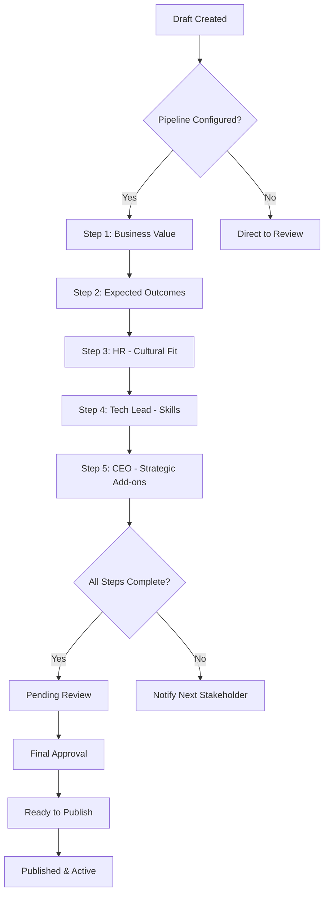

# Proofound — System Architecture Supplement

**Document Version:** 1.0
**Last Updated:** 2025-10-29
**Purpose:** Supplementary documentation for new features and systems
**Parent Document:** `SYSTEM_ARCHITECTURE_COMPREHENSIVE.md`

---

## Table of Contents

1. [Expertise Atlas System](#1-expertise-atlas-system)
2. [Assignment Creation Workflow](#2-assignment-creation-workflow)
3. [Skill Adjacency & Graph Matching](#3-skill-adjacency--graph-matching)
4. [Match Explainability System](#4-match-explainability-system)
5. [Practical Fit Scoring (Expanded)](#5-practical-fit-scoring-expanded)
6. [Sensitive Field Visibility](#6-sensitive-field-visibility)

---

## 1. Expertise Atlas System

### 1.1 Overview

**Expertise Atlas** is Proofound's central skills management system that goes beyond traditional "skills lists" to provide a comprehensive, evidence-backed representation of a person's capabilities.

**Key Differentiators:**
- **4-Level Taxonomy**: L1 (6 domains) → L2 (categories) → L3 (subcategories) → L4 (10,000+ granular skills)
- **Proof-Based**: Every skill requires evidence (projects, artifacts, verifications)
- **Recency Tracking**: Automatically calculates skill freshness from project usage
- **Outcome Attribution**: Links skills to measurable impact from projects
- **Multi-Use Artifacts**: Same artifact can prove multiple skills

### 1.2 Data Structure

#### Skills Taxonomy Hierarchy

```
L1: 6 Skill Domains
├─ 01: Technical Skills
├─ 02: Design & Creative
├─ 03: Business & Management
├─ 04: Communication & Social
├─ 05: Research & Analysis
└─ 06: Specialized & Domain

L2: Large Categories (e.g., within Technical)
├─ 01.01: Programming Languages
├─ 01.02: Web Development
├─ 01.03: Databases & Data Storage
├─ 01.04: Infrastructure & DevOps
└─ ...

L3: Subcategories (e.g., within Databases)
├─ 01.03.01: Relational Databases
├─ 01.03.02: NoSQL Databases
└─ 01.03.03: Data Warehousing

L4: Granular Skills (10,000+ items)
├─ 01.03.01.001: PostgreSQL
├─ 01.03.01.002: MySQL
├─ 01.03.01.003: SQL Query Optimization
└─ ...
```

**Skill Code Format**: `01.03.01.142` (zero-padded: L1.L2.L3.L4)

#### L4 Skill Attributes

Each L4 skill in a user's atlas has:

| Attribute | Description | Source | Example |
|-----------|-------------|--------|---------|
| **Competency Level** | C1-C5 proficiency | User self-assessment | C4 (Advanced) |
| **Proof Artifacts** | Links, docs (≤5MB) | Projects, experiences | GitHub repo, certificate |
| **Verifications** | Peer/employer verified | Verification workflow | Verified by CTO at Acme Corp |
| **Recency** | Last used date | Project linkage (ongoing/concluded) | Last used: 2024-12 (ongoing) |
| **Impact Score** | Contribution to outcomes | Project outcomes | 0.85 (high impact) |
| **Evidence Strength** | Verification quality (0-1) | Count + type of verifications | 0.78 (3 verifications) |
| **Total Experience** | Months of usage | Sum across projects | 24 months |

### 1.3 Project-Skill Linkage

**Core Concept**: Skills don't exist in isolation—they're always used *in context* (projects).

```
User creates Project:
├─ Title: "E-commerce Platform Redesign"
├─ Status: Ongoing | Concluded
├─ Dates: 2023-06 → 2024-12
├─ Outcomes: {metrics: [{name: "Conversion rate", value: 25, unit: "%"}], impact_score: 0.82}
└─ Skills Used:
    ├─ 01.02.15.047 (React) → C4, daily, high impact
    ├─ 01.02.15.092 (TypeScript) → C4, daily, high impact
    ├─ 01.03.01.001 (PostgreSQL) → C3, weekly, medium impact
    └─ 02.01.03.023 (Figma) → C2, occasionally, medium impact
```

**Recency Calculation**:
```typescript
// Ongoing projects → recency = 1.0 (max)
// Concluded projects → recency = exp(-α * months_since_end)
// Default α = 0.0578 (12-month half-life)

// Example:
// Skill last used 6 months ago:
recency = exp(-0.0578 * 6) = 0.71 (71% fresh)

// Skill last used 24 months ago:
recency = exp(-0.0578 * 24) = 0.25 (25% fresh)
```

**Impact Score Calculation**:
```typescript
// Average across all projects using this skill:
impact_score = avg(
  project_skill.outcome_contribution * project.outcomes.impact_score
)

// Example:
// Project A: contribution=0.9, impact=0.85 → 0.765
// Project B: contribution=0.7, impact=0.60 → 0.420
// Average: (0.765 + 0.420) / 2 = 0.593
```

### 1.4 "My Projects" Tab

**Location**: `/app/i/expertise/projects`

**Purpose**: Central hub for managing all projects across work, volunteer, education, side projects, and hobbies.

**Features**:
- Create projects with timeline (ongoing/concluded)
- Link multiple L4 skills to each project
- Define measurable outcomes and metrics
- Upload artifacts (same artifact can link to multiple projects + skills)
- Request verification from project stakeholders
- Track impact and skill growth over time

**Relationship to Other Proof Tables**:
- `experiences` → can link to project_id
- `education` → can link to project_id
- `volunteering` → can link to project_id
- `impact_stories` → can link to project_id

**Example Flow**:
```
1. User creates experience: "Senior Developer at Acme Corp (2022-2024)"
2. User creates project: "Payment Gateway Integration (2023-Q2)"
   ├─ Links to experience
   └─ Adds skills: Stripe API, Node.js, PostgreSQL
3. User uploads artifact: "Technical Design Doc (payment-gateway.pdf)"
   ├─ Attaches to project
   └─ Proves: Stripe API + Node.js + System Design
4. User requests verification from Tech Lead
5. Tech Lead verifies → boosts evidence_strength for all linked skills
```

### 1.5 Expertise Atlas UI

**View Modes**:

1. **List View** (default): All skills grouped by L1 → L2 → L3
   - Sortable by: recency, competency, evidence strength, impact
   - Filterable by: category, verification status, recency range

2. **Graph View**: Visual network of skills with adjacency relationships
   - Node size = competency level
   - Node color = recency (green = recent, orange = stale)
   - Edges = adjacency strength

3. **Timeline View**: Skills on timeline showing when they were used
   - Stacked by project
   - Shows skill acquisition and growth over time

**Skill Card Components**:
```
┌─────────────────────────────────────────────────┐
│ PostgreSQL                        01.03.01.001  │
│ Relational Databases                            │
├─────────────────────────────────────────────────┤
│ ● C4 (Advanced)              ⭐ Verified         │
│ ⏱️ Last used: 2 days ago      📊 24 mo exp      │
│ 💡 Impact: High (0.85)        🔗 3 projects     │
├─────────────────────────────────────────────────┤
│ Evidence:                                        │
│ • Verified by CTO @ Acme (2024-10)              │
│ • GitHub: payment-service (2024-12)             │
│ • AWS Certification (2023-06)                   │
├─────────────────────────────────────────────────┤
│ Related Skills: MySQL, SQL Query Optimization   │
│ [View Projects] [Add Evidence] [Request Verify] │
└─────────────────────────────────────────────────┘
```

### 1.6 Matching Integration

**How Expertise Atlas Powers Matching**:

1. **Skill Matching**: Uses L4 codes + adjacency graph for "nearby skills"
2. **Level Matching**: Compares competency (C1-C5) against requirements
3. **Evidence Weighting**: Higher evidence_strength = higher score
4. **Recency Decay**: Recent skills weighted higher (exp(-α * months))
5. **Impact Bonus**: High-impact skills get slight boost
6. **Outcome Linkage**: Skills tied to measurable outcomes score higher

**Algorithm Reference**: See Section 9.1 of main architecture doc

---

## 2. Assignment Creation Workflow

### 2.1 Overview

Assignment creation is **not** a single-person, single-step process. It's a **multi-stakeholder pipeline** where different roles contribute their expertise to define what's needed.

**Key Principles**:
- Different stakeholders define different requirements
- HR defines cultural fit and values
- Tech Lead defines technical skills and tools
- CEO/Hiring Manager defines strategic alignment and outcomes
- Pipeline is **fully customizable** per organization

### 2.2 Pipeline Flow



### 2.3 Pipeline Steps (Example)

#### Step 1: Business Value (Hiring Manager)
**Input**:
- What business problem does this role solve?
- Expected ROI or impact

**Example**:
```json
{
  "business_value": "Increase sales outreach capacity by 50%",
  "expected_impact": "Generate 10,000 qualified leads per quarter",
  "strategic_priority": "high"
}
```

#### Step 2: Expected Outcomes (Hiring Manager)
**Input**:
- Continuous metrics (tracked over time)
- Milestones (one-time goals)
- Success criteria

**Example**:
```json
{
  "outcomes": [
    {
      "type": "milestone",
      "title": "Launch new sales CRM",
      "success_criteria": "CRM deployed and team trained by Q2",
      "target_date": "2025-06-30",
      "metrics": [
        {"name": "User adoption", "target": 100, "unit": "percent"}
      ]
    },
    {
      "type": "continuous",
      "title": "Monthly lead generation",
      "success_criteria": "Maintain 10k leads/month",
      "metrics": [
        {"name": "Qualified leads", "target": 10000, "unit": "leads/month"}
      ]
    }
  ]
}
```

#### Step 3: Cultural Fit (HR)
**Input**:
- Required values (from values taxonomy)
- Required causes (from causes taxonomy)
- Work style preferences
- Team culture notes

**Example**:
```json
{
  "values_required": ["transparency", "sustainability", "innovation"],
  "causes_required": ["climate_action", "digital_inclusion"],
  "work_style": "Collaborative, fast-paced startup environment",
  "team_culture": "Flat hierarchy, high autonomy, weekly retros"
}
```

#### Step 4: Technical Skills (Tech Lead)
**Input**:
- Required L4 skills with min levels
- Nice-to-have L4 skills
- Link each skill to outcomes (why needed?)
- Provide examples of tasks

**Example**:
```json
{
  "expertise_matrix": [
    {
      "skill_code": "01.02.15.047",
      "skill_name": "React",
      "min_level": 4,
      "is_required": true,
      "linked_outcome_id": "uuid-outcome-1",
      "rationale": "Needed to build CRM frontend",
      "examples": "Build responsive dashboards, integrate APIs",
      "weight": 1.5
    },
    {
      "skill_code": "01.03.01.001",
      "skill_name": "PostgreSQL",
      "min_level": 3,
      "is_required": true,
      "linked_outcome_id": "uuid-outcome-1",
      "rationale": "Design database schema for CRM",
      "examples": "Optimize queries, design indexes",
      "weight": 1.2
    },
    {
      "skill_code": "01.02.17.089",
      "skill_name": "GraphQL",
      "min_level": 2,
      "is_required": false,
      "rationale": "Nice to have for API layer",
      "weight": 0.5
    }
  ]
}
```

#### Step 5: Strategic Add-ons (CEO)
**Input**:
- Additional strategic requirements
- Growth opportunities
- Long-term vision alignment

**Example**:
```json
{
  "strategic_notes": "Looking for someone who can grow into tech lead role within 2 years",
  "growth_opportunities": "Potential to lead team of 5 engineers by 2027",
  "additional_requirements": [
    {"skill_code": "03.04.02.015", "skill_name": "Team Leadership", "min_level": 2}
  ]
}
```

### 2.4 State Machine

**Assignment States**:

| State | Description | Who Can Transition | Next States |
|-------|-------------|-------------------|-------------|
| `draft` | Initial creation | Creator | `pipeline_in_progress`, `ready_to_publish` |
| `pipeline_in_progress` | Going through steps | System (auto) | `pending_review` |
| `pending_review` | Awaiting final approval | Admin/Owner | `ready_to_publish`, `draft` (reject) |
| `ready_to_publish` | Approved, ready to go live | Admin/Owner | `published` (sets status=active) |
| `published` | Live and matching | N/A | (status changes: active/paused/closed) |

**Pipeline Step States**:

| State | Description |
|-------|-------------|
| `pending` | Awaiting stakeholder action |
| `in_progress` | Stakeholder is working on it |
| `completed` | Stakeholder finished |
| `skipped` | Step bypassed (optional step) |
| `rejected` | Stakeholder rejected, sends back to previous step |

### 2.5 Notifications

**Auto-notifications sent when**:
- Stakeholder's step becomes active (`pending` → send email)
- Step not started after 48 hours → reminder
- Step not completed after 7 days → escalation to org admin
- Pipeline complete → notify hiring manager for final review

### 2.6 Database Schema Reference

**Tables**:
- `assignment_outcomes` - Outcomes and milestones
- `assignment_expertise_matrix` - Multi-stakeholder skill requirements
- `assignment_creation_pipeline` - Pipeline state machine
- `assignment_field_visibility` - Sensitive field rules (see Section 6)

**Migration**: `20250133_add_assignment_workflow_system.sql`

---

## 3. Skill Adjacency & Graph Matching

### 3.1 Concept

**Problem**: Exact skill matching is too rigid.
- Candidate has "Kubernetes" but job requires "Container Orchestration" → Should match!
- Candidate has "PostgreSQL" but job requires "Relational Databases" → Should match!

**Solution**: **Adjacency Graph** - skills that are related/similar get partial credit.

### 3.2 Adjacency Types

| Type | Description | Distance | Example |
|------|-------------|----------|---------|
| **Exact** | Same L4 code | 0 | PostgreSQL = PostgreSQL |
| **L3 Adjacent** | Same L1.L2.L3, different L4 | 1 | PostgreSQL ↔ MySQL |
| **L2 Adjacent** | Same L1.L2, different L3 | 2 | PostgreSQL ↔ MongoDB (same DB domain) |
| **L1 Adjacent** | Same L1, different L2 | 3 | PostgreSQL ↔ React (both technical) |
| **Semantic** | Related via graph edge | 1-2 | "Kubernetes" ↔ "Container Orchestration" |

### 3.3 Adjacency Factor Calculation

**Formula**: `adj_factor = exp(-λ * distance)`

**Default λ = 0.7** (decay constant)

**Examples**:
```
Distance 0 (exact):    adj = exp(-0.7 * 0) = 1.00   (100%)
Distance 1 (L3 adj):   adj = exp(-0.7 * 1) = 0.497  (50%)
Distance 2 (L2 adj):   adj = exp(-0.7 * 2) = 0.247  (25%)
Distance 3 (L1 adj):   adj = exp(-0.7 * 3) = 0.123  (12%)
```

**Rationale**: Skills become exponentially less relevant as distance increases.

### 3.4 Skill Adjacency Graph

**Schema**: `skill_adjacency` table

```sql
CREATE TABLE skill_adjacency (
    from_code TEXT,       -- e.g., "01.04.07.142" (Kubernetes)
    to_code TEXT,         -- e.g., "01.04.07.089" (Docker Swarm)
    relation_type TEXT,   -- 'is_a', 'related_to', 'adjacent_to', 'prerequisite_of'
    distance INTEGER,     -- 1, 2, or 3
    strength NUMERIC,     -- Optional manual override (0-1)
    PRIMARY KEY (from_code, to_code)
);
```

**Example Edges**:
```sql
-- Same category: Container orchestration tools
('01.04.07.142', '01.04.07.089', 'related_to', 1, 0.85),  -- Kubernetes ↔ Docker Swarm
('01.04.07.142', '01.04.07.015', 'related_to', 1, 0.70),  -- Kubernetes ↔ Nomad

-- Prerequisite relationships
('01.04.07.001', '01.04.07.142', 'prerequisite_of', 1, 0.95),  -- Docker → Kubernetes
('01.03.01.003', '01.03.01.001', 'prerequisite_of', 2, 0.80),  -- SQL Basics → PostgreSQL

-- Abstract concepts
('01.04.07.999', '01.04.07.142', 'is_a', 1, 1.0),  -- "Container Orchestration" → Kubernetes
```

### 3.5 Matching Logic with Adjacency

**Scenario**: Job requires "Container Orchestration (C4)", candidate has "Kubernetes (C4)"

**Without Adjacency**:
```
Required: "Container Orchestration" (code: 01.04.07.999)
Candidate: "Kubernetes" (code: 01.04.07.142)
Match: ❌ No exact match → score = 0
```

**With Adjacency**:
```
Required: "Container Orchestration" (code: 01.04.07.999)
Candidate: "Kubernetes" (code: 01.04.07.142)
Graph Lookup: 01.04.07.999 → 01.04.07.142 (relation: "is_a", distance: 1)
Adjacency Factor: exp(-0.7 * 1) = 0.497
Level Match: min(C4 / C4, 1) = 1.0
Per-Match Score: 0.497 * 1.0 * [recency] * [evidence] * [impact] = ~0.40
Match: ✅ Partial credit (40-50% of full match)
```

### 3.6 Building the Adjacency Graph

**Phase 1: Auto-generate from taxonomy**
```python
# For all skills in same L3:
for skill_a, skill_b in pairs_in_same_l3():
    insert_edge(skill_a, skill_b, 'adjacent_to', distance=1)

# For all skills in same L2:
for skill_a, skill_b in pairs_in_same_l2():
    if not edge_exists(skill_a, skill_b):
        insert_edge(skill_a, skill_b, 'adjacent_to', distance=2)

# And so on for L1...
```

**Phase 2: Curate semantic relationships**
```sql
-- Manual curation by domain experts
INSERT INTO skill_adjacency VALUES
  ('kubernetes', 'container_orchestration', 'is_a', 1, 1.0),
  ('react', 'vue', 'related_to', 1, 0.75),  -- Similar frameworks
  ('python', 'data_analysis', 'prerequisite_of', 1, 0.85);
```

**Phase 3: Learn from matching outcomes**
```python
# If users with skill_a consistently match well with jobs requiring skill_b:
# → Infer adjacency relationship
# → Add edge with strength based on correlation
```

### 3.7 Helper Functions

**SQL Function**: `skill_adjacency_factor(code1, code2, lambda)`

**TypeScript Function**:
```typescript
function skillAdjacencyFactor(
  requiredCode: string,
  candidateCode: string,
  lambda: number = 0.7
): number {
  // 1. Check for exact match
  if (requiredCode === candidateCode) return 1.0;

  // 2. Look up explicit edge in graph
  const edge = await db.query(`
    SELECT distance, strength
    FROM skill_adjacency
    WHERE (from_code = $1 AND to_code = $2)
       OR (from_code = $2 AND to_code = $1)
    LIMIT 1
  `, [requiredCode, candidateCode]);

  if (edge) {
    return Math.exp(-lambda * edge.distance) * (edge.strength || 1.0);
  }

  // 3. Fall back to taxonomy distance
  const dist = taxonomyDistance(requiredCode, candidateCode);
  if (dist === null || dist > 3) return 0;

  return Math.exp(-lambda * dist);
}

function taxonomyDistance(code1: string, code2: string): number | null {
  const [l1_a, l2_a, l3_a, l4_a] = code1.split('.');
  const [l1_b, l2_b, l3_b, l4_b] = code2.split('.');

  if (l1_a === l1_b && l2_a === l2_b && l3_a === l3_b) return 1; // Same L3
  if (l1_a === l1_b && l2_a === l2_b) return 2; // Same L2
  if (l1_a === l1_b) return 3; // Same L1
  return null; // Different L1 → no adjacency
}
```

---

## 4. Match Explainability System

### 4.1 Overview

Every match shows **"Why this match?"** with:
1. **Score breakdown** by component (skills, values, practical)
2. **Top drivers** (what contributed most)
3. **Improvement suggestions** with **numeric deltas** ("Add proof X → +8-12%")

### 4.2 Explanation Structure

**API Response**:
```json
{
  "match_id": "uuid",
  "assignment_id": "uuid",
  "profile_id": "uuid",
  "score": 0.86,
  "components": {
    "skills": 0.62,      // Weighted by 55%
    "mvv": 0.17,         // Weighted by 25%
    "practical": 0.12    // Weighted by 20%
  },
  "explain": [
    {
      "type": "skills",
      "weight": 0.34,
      "detail": "Matched 7/9 required skills at level (React C4, PostgreSQL C4, Node.js C3, ...)",
      "matched_skills": [
        {"code": "01.02.15.047", "name": "React", "required": 4, "candidate": 4, "match": 1.0},
        {"code": "01.03.01.001", "name": "PostgreSQL", "required": 3, "candidate": 4, "match": 1.0},
        {"code": "01.02.16.032", "name": "GraphQL", "required": 3, "candidate": 0, "match": 0.5, "adjacent": "REST API"}
      ],
      "coverage": 0.78
    },
    {
      "type": "mission",
      "weight": 0.12,
      "detail": "Mission similarity 0.83; shared causes: 'climate resilience', 'open education'",
      "mission_cosine": 0.83,
      "shared_values": ["transparency", "sustainability"],
      "shared_causes": ["climate_action", "digital_inclusion"]
    },
    {
      "type": "practical",
      "weight": 0.08,
      "detail": "Comp target 55k within 50–60k; 100% availability overlap; hybrid commute 14 km",
      "comp_match": 0.95,
      "avail_match": 1.0,
      "location_match": 0.87,
      "visa_match": 1.0
    }
  ],
  "suggestions": [
    {
      "type": "add_skill",
      "skill_code": "01.02.17.089",
      "skill_name": "GraphQL",
      "estimated_impact": "+8 to +12 points",
      "rationale": "Nice-to-have skill with 1.0 weight",
      "action_url": "/app/i/expertise?add=01.02.17.089"
    },
    {
      "type": "add_proof",
      "skill_code": "01.02.15.047",
      "skill_name": "React",
      "estimated_impact": "+3 to +5 points",
      "rationale": "Increase evidence strength from 0.6 to 0.9",
      "action_url": "/app/i/expertise/evidence?skill=01.02.15.047"
    },
    {
      "type": "update_value",
      "value_tag": "innovation",
      "estimated_impact": "+2 to +4 points",
      "rationale": "Org highly values 'innovation' (weight 1.5)",
      "action_url": "/app/i/profile/edit#values"
    }
  ]
}
```

### 4.3 Improvement Tip Calculation

**Goal**: Show users **exactly** how to improve their match score.

**Algorithm**:
```typescript
function calculateImprovementSuggestions(
  match: Match,
  assignment: Assignment,
  profile: Profile
): Suggestion[] {
  const suggestions: Suggestion[] = [];

  // 1. Missing required skills
  for (const req of assignment.required_skills) {
    const hasSkill = profile.skills.some(s => s.code === req.code);
    if (!hasSkill) {
      const impact = estimateSkillAddition(req, match.weights);
      suggestions.push({
        type: 'add_skill',
        skill_code: req.code,
        skill_name: req.name,
        estimated_impact: `+${impact.min} to +${impact.max} points`,
        rationale: `Required skill with ${req.weight} weight`,
      });
    }
  }

  // 2. Low evidence strength
  for (const skill of profile.skills) {
    if (skill.evidence_strength < 0.7) {
      const current_contribution = skill.weight_in_score;
      const potential_contribution = current_contribution * (0.9 / skill.evidence_strength);
      const delta = (potential_contribution - current_contribution) * 100;

      if (delta > 2) {
        suggestions.push({
          type: 'add_proof',
          skill_code: skill.code,
          skill_name: skill.name,
          estimated_impact: `+${Math.floor(delta)} to +${Math.ceil(delta * 1.3)} points`,
          rationale: `Increase evidence from ${(skill.evidence_strength * 100).toFixed(0)}% to 90%`,
        });
      }
    }
  }

  // 3. Missing values/causes
  for (const value of assignment.values_required) {
    if (!profile.values.includes(value)) {
      const impact = estimateValueAddition(value, assignment, match.weights);
      suggestions.push({
        type: 'update_value',
        value_tag: value,
        estimated_impact: `+${impact.min} to +${impact.max} points`,
        rationale: `Org highly values '${value}'`,
      });
    }
  }

  // Sort by estimated impact (descending)
  return suggestions.sort((a, b) => extractMax(b.estimated_impact) - extractMax(a.estimated_impact));
}

function estimateSkillAddition(req: Requirement, weights: Weights): {min: number, max: number} {
  // Simplified: contribution = (req.weight / total_req_weight) * W_skill * 100
  const skill_weight = weights.W_skill || 0.55;
  const contribution = (req.weight / assignment.total_req_weight) * skill_weight * 100;

  // Account for level (if not at req level, less impact)
  const level_factor = 0.8; // Conservative estimate

  return {
    min: Math.floor(contribution * level_factor * 0.8),
    max: Math.ceil(contribution * level_factor * 1.2),
  };
}
```

### 4.4 UI Display

**Explanation Card**:
```
┌──────────────────────────────────────────────────────────────┐
│ Match Score: 86/100                                    ⭐⭐⭐⭐  │
├──────────────────────────────────────────────────────────────┤
│ Why This Match?                                               │
│                                                               │
│ 🎯 Skills (62%)                                               │
│    Matched 7/9 required skills at level                      │
│    • React C4 ✅  PostgreSQL C4 ✅  Node.js C3 ✅             │
│    • GraphQL (adjacent: REST API) 🟡  TypeScript ❌          │
│                                                               │
│ 💡 Mission & Values (17%)                                     │
│    Mission similarity: 83%                                    │
│    Shared values: Transparency, Sustainability               │
│    Shared causes: Climate Action, Digital Inclusion          │
│                                                               │
│ 📍 Practical Fit (12%)                                        │
│    ✅ Comp target within range ($55k vs $50-60k)             │
│    ✅ 100% availability overlap                               │
│    ✅ Hybrid commute 14 km (within 30 km radius)             │
│    ✅ Visa sponsorship available (H1-B)                      │
├──────────────────────────────────────────────────────────────┤
│ 🚀 How to Improve Your Match:                                │
│                                                               │
│ 1. Add GraphQL skill                            +8 to +12    │
│    Nice-to-have skill with high weight                       │
│    [Add Skill]                                               │
│                                                               │
│ 2. Add proof for React                          +3 to +5     │
│    Increase evidence strength from 60% to 90%                │
│    [Add Evidence]                                            │
│                                                               │
│ 3. Add 'Innovation' to your values              +2 to +4     │
│    Org highly values innovation (weight 1.5)                 │
│    [Update Profile]                                          │
└──────────────────────────────────────────────────────────────┘
```

---

## 5. Practical Fit Scoring (Expanded)

### 5.1 Components

**Practical Fit Score** combines 7 sub-scores:

| Component | Weight | Description | Hard Gate? |
|-----------|--------|-------------|------------|
| **Compensation** | 25% | Salary target vs budget | Optional |
| **Availability** | 20% | Schedule overlap (7×48 bitmap) | No |
| **Timezone** | 10% | TZ compatibility for remote/hybrid | No |
| **Location** | 20% | Distance for onsite/hybrid | Optional |
| **Language** | 15% | Required language proficiency | Yes (default) |
| **Work Auth** | 10% | Visa sponsorship compatibility | Yes (default) |
| **Benefits** | 5% | Benefits match (required vs offered) | No |

**Total**: `w_comp * comp + w_avail * avail + w_tz * tz + w_dist * dist + w_lang * lang + w_auth * auth + w_benef * benef`

### 5.2 Compensation Scoring

**Inputs**:
- Candidate: `comp_target`, `comp_currency`
- Assignment: `comp_min`, `comp_max`, `comp_currency`

**Hard Gate** (optional):
```typescript
if (candidate.comp_min > assignment.comp_max) {
  return REJECT; // Candidate's minimum exceeds budget
}
```

**Sigmoid Score**:
```typescript
function compensationScore(
  targetUSD: number,
  budgetMinUSD: number,
  budgetMaxUSD: number,
  k: number = 10.0
): number {
  const budgetMid = (budgetMinUSD + budgetMaxUSD) / 2;
  const diffRatio = (budgetMid - targetUSD) / budgetMid;

  // Sigmoid: 1 / (1 + exp(-k * diffRatio))
  // Positive diff (budget > target) → score → 1
  // Negative diff (target > budget) → score → 0
  return 1.0 / (1.0 + Math.exp(-k * diffRatio));
}
```

**Examples**:
```
Target $55k, Budget $50-60k (mid $55k):
  diffRatio = 0 → score = 1 / (1 + exp(0)) = 0.5 → 50% (fair match)

Target $50k, Budget $60-80k (mid $70k):
  diffRatio = +0.286 → score = 0.89 → 89% (candidate well within budget)

Target $75k, Budget $50-60k (mid $55k):
  diffRatio = -0.364 → score = 0.03 → 3% (candidate too expensive)
```

### 5.3 Availability Scoring (7×48 Bitmap)

**Bitmap Structure**:
- 7 days × 48 half-hours = **336 bits**
- Bit 0 = Monday 00:00-00:30
- Bit 1 = Monday 00:30-01:00
- ...
- Bit 335 = Sunday 23:30-00:00

**Example**:
```
Candidate available: Mon-Fri 9am-5pm (160 bits set)
Role requires: Mon-Fri 10am-4pm (120 bits set)
Overlap: 120 bits (all required hours covered)
Score: 120 / 120 = 1.0 (100%)
```

**SQL Function**:
```sql
CREATE FUNCTION calculate_availability_overlap(
  candidate_bitmap BIT(336),
  required_bitmap BIT(336)
) RETURNS NUMERIC AS $$
  SELECT
    bit_count(candidate_bitmap & required_bitmap)::NUMERIC /
    NULLIF(bit_count(required_bitmap), 0)
$$;
```

**TypeScript Equivalent**:
```typescript
function availabilityOverlap(
  candidateBitmap: string, // '0101...' (336 bits)
  requiredBitmap: string
): number {
  const requiredBits = countOnes(requiredBitmap);
  if (requiredBits === 0) return 1.0; // No requirement = full overlap

  const overlapBits = countOnes(bitwiseAnd(candidateBitmap, requiredBitmap));
  return overlapBits / requiredBits;
}
```

### 5.4 Timezone Scoring

**Inputs**:
- Candidate: `tz` (e.g., "America/New_York")
- Assignment: `tz_required` (e.g., "Europe/Stockholm")

**Calculation**:
```typescript
function timezoneOverlap(
  candidateTz: string,
  requiredTz: string,
  workHoursStart: number = 9, // 9am
  workHoursEnd: number = 17   // 5pm
): number {
  const tzOffsetDiff = Math.abs(getTzOffset(candidateTz) - getTzOffset(requiredTz));
  const hoursPerDay = workHoursEnd - workHoursStart;

  // Calculate overlap of working hours
  const overlap = Math.max(0, hoursPerDay - tzOffsetDiff);
  return overlap / hoursPerDay;
}
```

**Examples**:
```
NYC (UTC-5) vs Stockholm (UTC+1) = 6 hours diff
  9am-5pm (8 hours) - 6 hours = 2 hours overlap
  Score: 2/8 = 0.25 (25%)

LA (UTC-8) vs London (UTC+0) = 8 hours diff
  9am-5pm (8 hours) - 8 hours = 0 hours overlap
  Score: 0/8 = 0.0 (0%) → Hard to collaborate
```

### 5.5 Location Scoring (Distance)

**Only applies if** `location_mode IN ('onsite', 'hybrid')`

**Calculation**:
```typescript
function locationScore(
  candidateGeo: {lat: number, lon: number},
  roleGeo: {lat: number, lon: number},
  radiusKm: number = 30
): number {
  const distKm = haversineDistance(candidateGeo, roleGeo);

  if (distKm <= radiusKm) return 1.0;

  // Exponential decay beyond radius
  return Math.exp(-(distKm - radiusKm) / radiusKm);
}
```

**Examples**:
```
Distance 10 km, Radius 30 km:
  Score = 1.0 (within radius)

Distance 45 km, Radius 30 km:
  Score = exp(-(45-30)/30) = exp(-0.5) = 0.61 (61%)

Distance 90 km, Radius 30 km:
  Score = exp(-(90-30)/30) = exp(-2) = 0.14 (14%)
```

### 5.6 Work Authorization & Sponsorship

**Inputs**:
- Candidate: `needs_sponsorship`, `wishes_sponsorship`, `work_authorization: {countries: []}`
- Assignment: `can_sponsor`, `sponsorship_countries: []`

**Logic**:
```typescript
function workAuthScore(
  candidate: {needsSponsor: boolean, wishesSponsor: boolean, authCountries: string[]},
  assignment: {canSponsor: boolean, sponsorCountries: string[]}
): {score: number, hardFail: boolean} {
  // If candidate doesn't need sponsorship, always compatible
  if (!candidate.needsSponsor) {
    return {score: 1.0, hardFail: false};
  }

  // If candidate needs but org can't sponsor → hard fail (if gate enabled)
  if (!assignment.canSponsor) {
    return {score: 0.0, hardFail: true}; // Can be softened to 0.2 if gate disabled
  }

  // Check country compatibility
  const overlap = candidate.authCountries.some(c =>
    assignment.sponsorCountries.includes(c)
  );

  if (!overlap) {
    return {score: 0.5, hardFail: false}; // Partial - may need relocation
  }

  return {score: 1.0, hardFail: false}; // Perfect match
}
```

### 5.7 Benefits Matching

**Inputs**:
- Candidate: `profile_benefits_prefs` (importance: required/preferred/nice_to_have)
- Assignment: `assignment_benefits_offered`

**Calculation**:
```typescript
function benefitsScore(
  candidatePrefs: {code: string, importance: string}[],
  assignmentOffers: {code: string}[]
): number {
  const required = candidatePrefs.filter(p => p.importance === 'required');
  const preferred = candidatePrefs.filter(p => p.importance === 'preferred');

  if (required.length === 0) return 1.0; // No requirements = perfect

  const requiredMet = required.filter(r =>
    assignmentOffers.some(o => o.code === r.code)
  ).length;

  const preferredMet = preferred.filter(p =>
    assignmentOffers.some(o => o.code === p.code)
  ).length;

  // 80% weight on required, 20% on preferred
  const reqScore = requiredMet / required.length;
  const prefScore = preferred.length > 0 ? (preferredMet / preferred.length) : 1.0;

  return 0.8 * reqScore + 0.2 * prefScore;
}
```

**Example**:
```
Candidate requires: [health_insurance, dental_insurance]
Candidate prefers: [gym_membership, learning_budget]
Assignment offers: [health_insurance, learning_budget, stock_options]

Required met: 1/2 = 0.5 (health yes, dental no)
Preferred met: 1/2 = 0.5 (learning yes, gym no)
Score: 0.8 * 0.5 + 0.2 * 0.5 = 0.5 (50%)
```

---

## 6. Sensitive Field Visibility

### 6.1 Overview

Organizations can mark certain assignment fields as **sensitive**—used in matching but **not visible** to candidates (at least initially).

**Use Case**: "Mutual respect" - some info is important for finding the right match but shouldn't be public knowledge.

**Examples of Sensitive Fields**:
- Maximum compensation budget (don't want to anchor negotiations)
- Internal job requisition code
- Hiring manager personal notes
- Strategic context (e.g., "replacement for fired employee")

### 6.2 Visibility Levels

| Level | Description | When Visible | Used in Matching? |
|-------|-------------|--------------|-------------------|
| `public` | Visible to all | Always (in job listings) | Yes |
| `post_match` | After mutual interest | After both parties express interest | Yes |
| `post_conversation_start` | After messaging begins | After conversation created | Yes |
| `hidden_used_for_matching` | Never shown to candidate | Never | Yes |
| `internal_only` | Org members only | Never | No |

### 6.3 Redaction Strategies

When a field is not yet visible:

| Strategy | Example | Display |
|----------|---------|---------|
| `hide` | Don't show at all | (Field omitted) |
| `mask` | Partial info | "Salary: $XX,XXX - $XX,XXX" → "Competitive salary" |
| `generic_label` | Replace with generic text | "$80,000 max" → "Budget allocated" |

### 6.4 Database Schema

**Table**: `assignment_field_visibility`

```sql
CREATE TABLE assignment_field_visibility (
    assignment_id UUID,
    field_name TEXT,              -- e.g., 'comp_max', 'hiring_manager_notes'
    field_category TEXT,          -- 'compensation', 'internal', 'strategic'
    visibility_level TEXT,        -- 'public', 'post_match', 'hidden_used_for_matching', 'internal_only'
    reveal_stage INTEGER,         -- 1 or 2 (for staged identity reveal)
    redaction_type TEXT,          -- 'hide', 'mask', 'generic_label'
    generic_label TEXT,           -- e.g., "Competitive salary", "Confidential requirement met"
    conditional_rules JSONB,      -- {"show_if": "candidate_score > 0.8"}
    PRIMARY KEY (assignment_id, field_name)
);
```

### 6.5 Auto-Population

**On Assignment Creation**:
```typescript
// Trigger: auto_populate_field_visibility()
// Inserts default rules for all system fields

// Example defaults:
{
  "comp_max": {
    visibility: "hidden_used_for_matching",
    redaction: "generic_label",
    label: "Competitive salary"
  },
  "comp_min": {
    visibility: "post_match",
    redaction: "mask",
    label: "Salary range available after mutual interest"
  },
  "hiring_manager_notes": {
    visibility: "internal_only",
    redaction: "hide"
  }
}
```

### 6.6 Matching with Sensitive Fields

**Key Principle**: Sensitive fields **are used** in matching algorithm but **never exposed** in explanations.

**Example**:
```typescript
// Matching algorithm:
const compScore = calculateCompensationScore(
  candidate.comp_target,
  assignment.comp_min,
  assignment.comp_max  // ← Sensitive field used here
);

// Explanation generation:
const visibility = await getFieldVisibility(assignment.id, 'comp_max');

if (visibility.level === 'hidden_used_for_matching') {
  explanation.push({
    type: 'practical',
    detail: "Compensation target compatible", // Generic
    // NO specific numbers shown
  });
} else {
  explanation.push({
    type: 'practical',
    detail: `Comp target ${candidate.comp_target} within ${assignment.comp_min}-${assignment.comp_max}`,
    // Specific numbers shown
  });
}
```

### 6.7 Staged Reveal

**Scenario**: Some fields become visible **after mutual interest** or **after conversation starts**.

**Flow**:
```
1. Candidate views match → sees "Competitive salary"
2. Candidate clicks "Interested" → still hidden
3. Org reciprocates interest → conversation created
4. System checks visibility rules:
   - comp_min (visibility: 'post_match') → REVEAL
   - comp_max (visibility: 'hidden_used_for_matching') → KEEP HIDDEN
5. Candidate now sees: "Salary: $50,000 - $XX,XXX"
```

**Implementation**:
```typescript
async function getVisibleFields(
  assignmentId: string,
  candidateId: string,
  conversationStage: number | null
): Promise<Record<string, any>> {
  const assignment = await loadAssignment(assignmentId);
  const visibilityRules = await loadVisibilityRules(assignmentId);
  const match = await loadMatch(assignmentId, candidateId);

  const visibleFields: Record<string, any> = {};

  for (const [field, value] of Object.entries(assignment)) {
    const rule = visibilityRules[field];

    // No rule = public
    if (!rule) {
      visibleFields[field] = value;
      continue;
    }

    // Check visibility level
    if (rule.visibility === 'public') {
      visibleFields[field] = value;
    } else if (rule.visibility === 'post_match' && match?.mutual_interest) {
      visibleFields[field] = value;
    } else if (rule.visibility === 'post_conversation_start' && conversationStage) {
      visibleFields[field] = value;
    } else if (rule.visibility === 'hidden_used_for_matching') {
      // Redact
      visibleFields[field] = rule.generic_label || '[Redacted]';
    } else if (rule.visibility === 'internal_only') {
      // Omit completely
      continue;
    }

    // Apply conditional rules
    if (rule.conditional_rules?.show_if) {
      if (!evaluateCondition(rule.conditional_rules.show_if, {match, candidate})) {
        visibleFields[field] = rule.generic_label || '[Redacted]';
      }
    }
  }

  return visibleFields;
}
```

### 6.8 Audit Trail

**Important**: All visibility decisions are logged for compliance.

```sql
CREATE TABLE assignment_field_access_log (
    id UUID PRIMARY KEY,
    assignment_id UUID,
    candidate_id UUID,
    field_name TEXT,
    accessed_at TIMESTAMP,
    visibility_level TEXT,
    was_redacted BOOLEAN,
    user_agent TEXT,
    ip_address TEXT
);
```

**Use Cases**:
- Audit: "Who saw the max budget?"
- Debug: "Why is candidate not seeing salary range?"
- Compliance: GDPR access logs

---

## Appendix: Migration Files Reference

All new features are implemented in the following migration files:

1. **`20250130_add_skills_taxonomy.sql`** (Section 1 & 3)
   - Skills taxonomy (L1→L2→L3→L4)
   - Skill adjacency graph
   - Helper functions for distance and adjacency factor

2. **`20250131_add_project_skills_linkage.sql`** (Section 1)
   - Projects table
   - Project-skills linkage
   - Recency, impact, and evidence strength calculations

3. **`20250132_add_benefits_and_work_authorization.sql`** (Section 5)
   - Benefits taxonomy
   - Work authorization fields
   - Availability bitmap (7×48)
   - Currency exchange rates
   - Helper functions for practical fit scoring

4. **`20250133_add_assignment_workflow_system.sql`** (Section 2 & 6)
   - Assignment outcomes
   - Expertise matrix (multi-stakeholder)
   - Creation pipeline state machine
   - Sensitive field visibility system

---

**End of Supplement**

For base architecture reference, see `SYSTEM_ARCHITECTURE_COMPREHENSIVE.md`.
