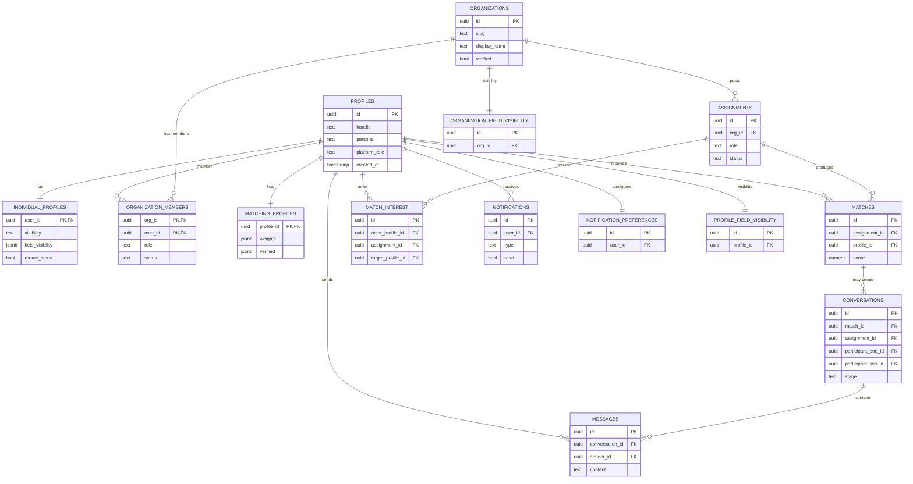

# Data Model (Core Slice)

This document captures the minimal set of entities needed to understand the main product flows.

Repo truth:

- Full schema: `src/db/schema.ts`
- Some privacy semantics are encoded in SQL policies: `src/db/policies.sql` and `supabase/migrations/*`

## Core Entities (What They Represent)

- `profiles`
  - One row per Supabase `auth.users` id (the primary user identity).
- `individual_profiles`
  - Individual persona profile fields plus privacy controls like `field_visibility` (JSONB) and `redact_mode`.
- `organizations`
  - Organization profiles (slug-based) for the org persona.
- `organization_members`
  - Many-to-many membership linking a user (`profiles.id`) to an org with a role.
- `assignments`
  - Org postings used for matching (role, requirements, gates, etc).
- `matching_profiles`
  - Per-user matching preferences and metadata (values, causes, availability, weights).
- `matches`
  - Cached match results between an `assignment` and a `profile`, with score + vector breakdown.
- `match_interest`
  - "Interested" actions used for mutual interest and downstream intro/messaging flows.
- `conversations` and `messages`
  - Staged messaging system with masked-to-revealed identity state.
- `notifications` and `notification_preferences`
  - In-app notifications and user preferences for notification channels.
- `organization_field_visibility` and `profile_field_visibility`
  - Granular visibility tables.
  - Note: individual profile visibility is also represented as JSONB on `individual_profiles.field_visibility`.

## Simplified ER Diagram (Mermaid)

## Privacy and Multi-Tenancy Boundaries

### Identity and Personas

- The canonical user identifier is `profiles.id` (UUID).
- Persona routing uses `profiles.persona` and org membership (see `src/lib/auth.ts`).

### Organization Access Control

- Many org-scoped operations gate access by checking for an active `organization_members` row.
  - Example: matching for an assignment verifies membership in `src/app/api/match/assignment/route.ts`.

### Field-Level Visibility

Repo truth shows two mechanisms:

1. JSONB visibility map on `individual_profiles.field_visibility`.
   - Updated via `src/app/api/profile/privacy-settings/route.ts`.

2. Dedicated visibility tables:
   - `profile_field_visibility`
   - `organization_field_visibility`

**Inference:** treat these as potentially legacy plus current mechanisms until the app standardizes on one. When changing privacy semantics, verify both DB policy and API read paths.

### RLS (Row Level Security)

- SQL policies live in `src/db/policies.sql` and in `supabase/migrations/*`.
- The app also performs authorization checks in code for many Drizzle DB operations.

## Schema and Migration Sources

- Drizzle schema source of truth for tables and types: `src/db/schema.ts`.
- Drizzle tooling output (generated SQL): `drizzle/` (see `drizzle.config.ts`).
- Supabase migrations (SQL): `supabase/migrations/`.
- Additional migration runner: `run-migrations.mjs` applies `migrations-to-run.sql` (see `package.json` script `db:migrate`).

When modifying schema:

- Decide which workflow is canonical for the change (Drizzle migration, Supabase migration, or the runner script).
- Update docs and runbooks so the team does not split across multiple sources of truth.
