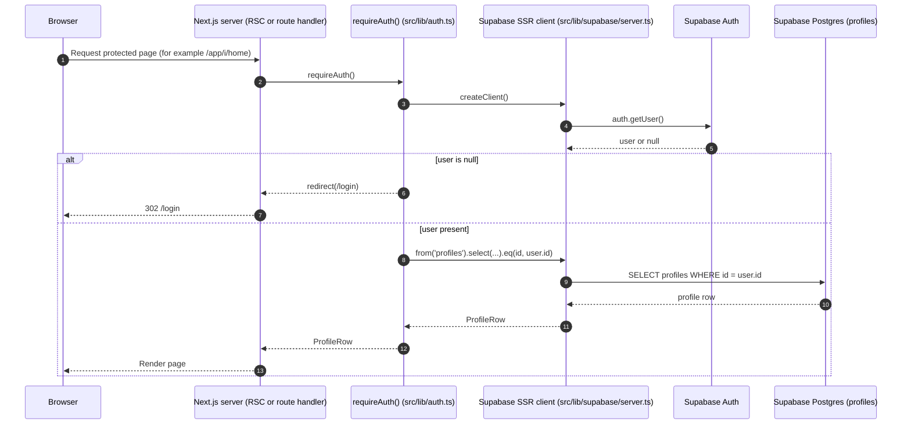
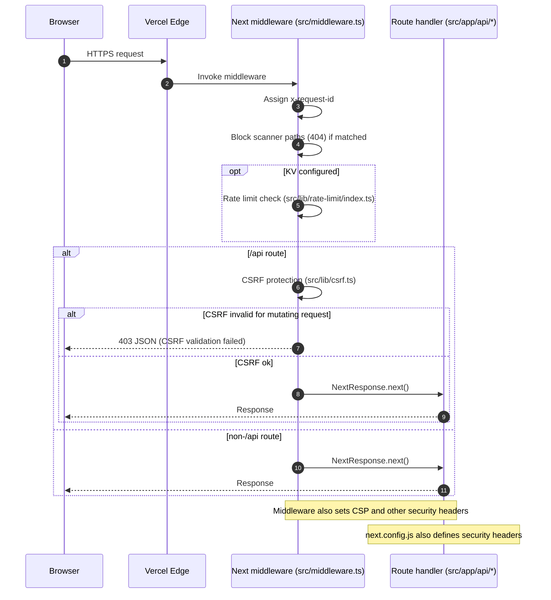
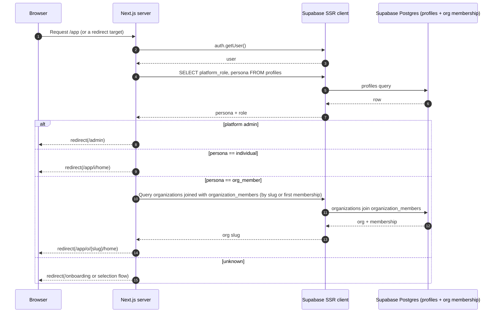
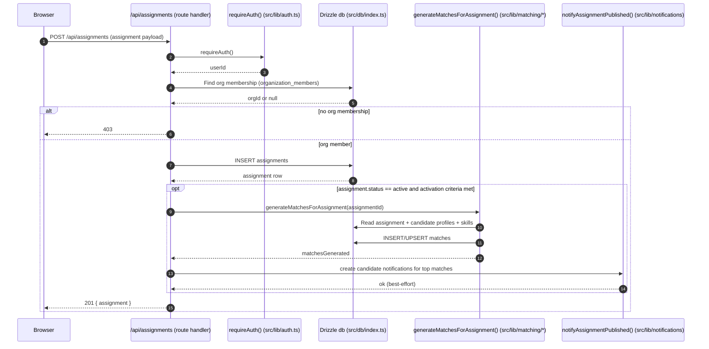
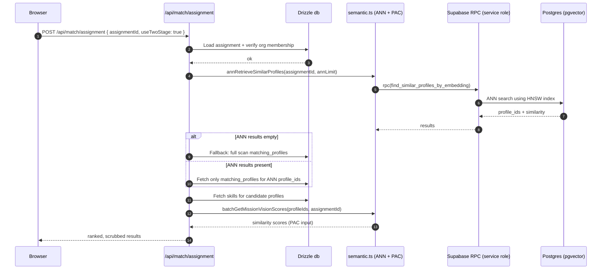
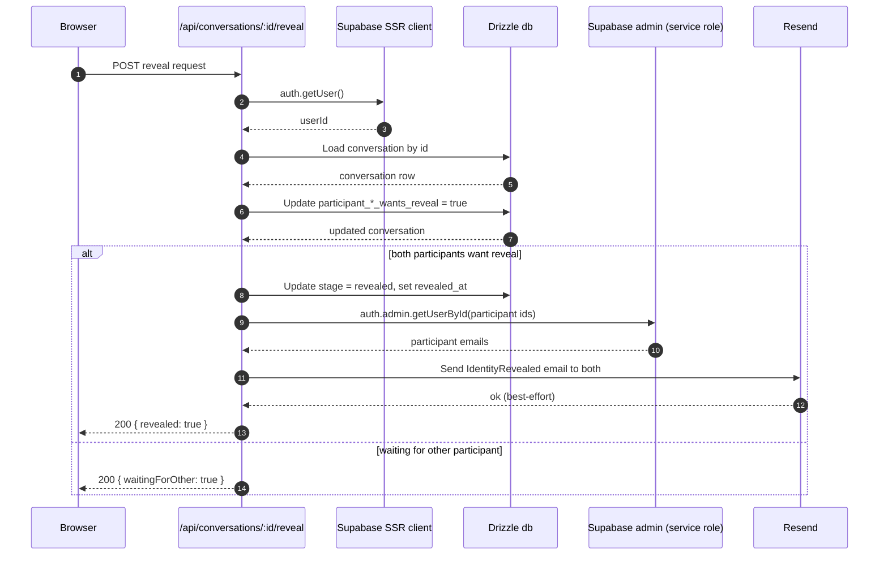
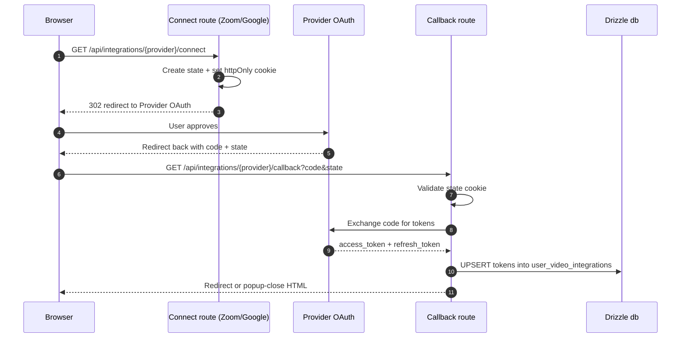
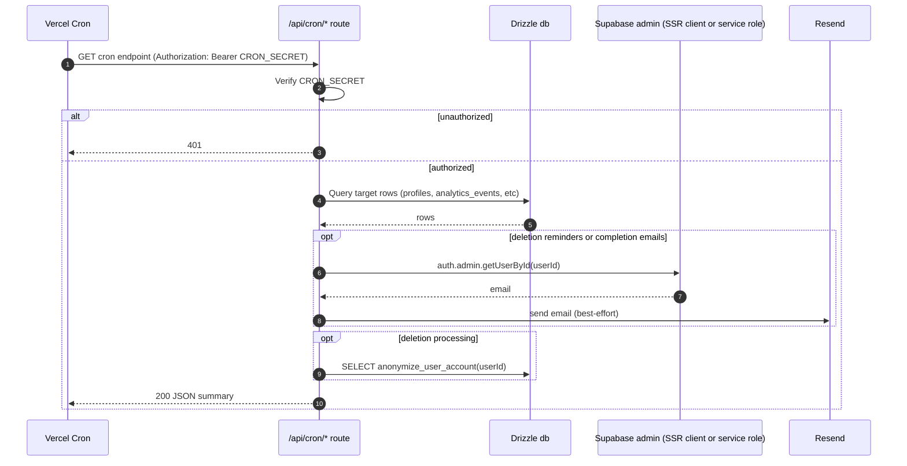

# Key Flows (Sequence Diagrams)

This doc focuses on the flows that matter most for onboarding and system evaluation. Each flow lists:

- Entrypoints (routes and key modules)
- A Mermaid sequence diagram (high level)
- Storage touched
- Side effects and failure modes
- Debug notes

## Flow 1: Auth and Session Bootstrapping

Entrypoints:

- `src/lib/supabase/server.ts` (server Supabase SSR client)
- `src/lib/supabase/client.ts` (browser Supabase client)
- `src/lib/auth.ts` (`getCurrentUser`, `requireAuth`)
- Protected pages under `src/app/app/*`

Storage touched:

- Supabase Auth session (cookie-based)
- `profiles` table (Supabase query via SSR client)

Failure modes:

- Supabase credentials missing causes server client creation to throw (`src/lib/supabase/server.ts`).
- Missing `profiles` row returns null user (caller usually treats as unauthenticated).

Debug notes:

- Check `docs/ENV_VARIABLES.md` for required Supabase vars.
- Verify cookies exist for Supabase SSR session on requests.

## Flow 2: Request Pipeline and Security (CSP, CSRF, Rate Limiting)

Entrypoints:

- `src/middleware.ts`
- `src/lib/csrf.ts`
- `src/lib/rate-limit/index.ts`
- `next.config.js` (additional headers)

Storage touched:

- Optional Vercel KV for rate limiting
- CSRF token cookie (`csrf_token`)

Failure modes:

- CSP drift between `next.config.js` and `src/middleware.ts` can break embeds, websockets, or dev tooling.
- KV outages or misconfiguration: rate limiting fails open, but logs warn (`src/middleware.ts`, `src/lib/rate-limit/index.ts`).

Debug notes:

- Check response headers for `Content-Security-Policy` and `x-request-id`.
- For 403 CSRF: confirm request includes `x-csrf-token` header and `csrf_token` cookie, or that the endpoint is intentionally exempt.

## Flow 3: Persona Routing and App Shells (Individual vs Org Member)

Entrypoints:

- `src/lib/auth.ts` (`resolveUserHomePath`, `getActiveOrg`, `getUserOrganizations`)
- Individual shell: `src/app/app/i/*`
- Org shell: `src/app/app/o/[slug]/*`

Storage touched:

- `profiles` (persona, platform role)
- `organization_members` and `organizations` for org routing

Failure modes:

- Users with `persona=org_member` but no active org membership can land in a dead end unless handled.

Debug notes:

- `getActiveOrg(slug, userId)` uses an inner join on membership and returns null when not active (`src/lib/auth.ts`).

## Flow 4: Create Assignment and Generate Matches (Org Workflow)

Entrypoints:

- `POST /api/assignments` (`src/app/api/assignments/route.ts`)
- Match generation: `src/lib/matching/generate-matches-for-assignment.ts`
- Notifications: `src/lib/notifications/*`, `src/lib/email/*`
- Candidate scoring logic: `src/lib/core/matching/*`

Storage touched:

- `organization_members`, `organizations`, `assignments`, `matches`, `notifications`

Side effects:

- May trigger SUS survey logic (`src/lib/surveys/sus-triggers.ts`) and emit analytics events (`src/lib/analytics/events.ts`).
- May send notifications to matched candidates (`src/lib/notifications`).

Failure modes:

- Missing DB connectivity returns 503 with connection hints (`src/app/api/assignments/route.ts`).
- Match generation can be expensive; timeouts depend on runtime limits and dataset size.

Debug notes:

- Look for `assignment.matches.generated` and `assignment.notification.failed` logs (`src/app/api/assignments/route.ts`, `src/lib/log.ts`).

## Flow 5: Two-Stage Semantic Matching (ANN + Re-rank)

Entrypoints:

- Two-stage assignment matching: `src/app/api/match/assignment/route.ts`
- Semantic module: `src/lib/matching/semantic.ts`
- Embedding model loader: `src/lib/matching/embeddings.ts`
- pgvector migration and RPC functions: `supabase/migrations/20251109_add_embedding_columns.sql`

Storage touched:

- `matching_profiles`, `skills`, `assignments`, `matches` (depending on route)
- Embedding columns and RPC functions in Postgres when enabled

Failure modes:

- Missing `SUPABASE_SERVICE_ROLE_KEY` breaks semantic RPC calls (ANN stage) and embedding writes.
- If embeddings are not present, ANN returns no results and the route falls back to full scan.

Debug notes:

- Verify the pgvector migration exists and was applied: `supabase/migrations/20251109_add_embedding_columns.sql`.
- Search logs for `match.assignment.stage1.*` events (`src/app/api/match/assignment/route.ts`).

## Flow 6: Messaging With Staged Identity Reveal

Entrypoints:

- Conversation and message routes: `src/app/api/conversations/*`
- Identity reveal endpoint: `src/app/api/conversations/[conversationId]/reveal/route.ts`
- Email template: `emails/IdentityRevealed*`
- Admin Supabase client (email lookup): `src/lib/supabase/admin.ts`

Storage touched:

- `conversations`, `messages`, `profiles`
- Supabase Auth user records (admin getUserById) for email addresses

Failure modes:

- Missing `RESEND_API_KEY` or `EMAIL_FROM` causes reveal emails to be skipped (logs error) while the reveal may still succeed (`src/app/api/conversations/[conversationId]/reveal/route.ts`).
- Missing service role blocks email lookup of user emails (`src/lib/supabase/admin.ts`).

Debug notes:

- Check `conversation.reveal_requested` and `conversation.revealed` logs.
- Confirm conversation stage and reveal flags in DB when debugging stuck states.

## Flow 7: OAuth Integrations (Zoom, Google, LinkedIn)

Entrypoints:

- Zoom: `src/app/api/integrations/zoom/connect/route.ts`, `src/app/api/integrations/zoom/callback/route.ts`
- Google: `src/app/api/integrations/google/connect/route.ts`, `src/app/api/integrations/google/callback/route.ts`
- LinkedIn: `src/app/api/auth/linkedin/callback/route.ts`

Storage touched:

- `user_video_integrations` (Zoom/Google)
- `user_integrations` (LinkedIn integration storage)

Failure modes:

- State cookie missing or mismatched rejects callback.
- Redirect URI mismatch in provider console breaks token exchange.

Debug notes:

- Confirm redirect URI logic uses `NEXT_PUBLIC_SITE_URL` (and fallback) in connect/callback routes.
- Check provider-specific setup docs for env vars (`docs/LINKEDIN_VERIFICATION_SETUP.md`, `OAUTH_SETUP_GUIDE.md`).

## Flow 8: Cron Workflows (Account Deletion, Decision Reminders, Health Checks)

Entrypoints:

- Schedule: `vercel.json`
- Account deletion: `src/app/api/cron/account-deletion-workflow/route.ts`
- Decision reminders and performance health check: `src/app/api/cron/decision-reminders/route.ts`
- Supporting libs: `src/lib/email/*`, `src/lib/decisions/automation.ts`, `src/lib/analytics/health-check.ts`

Storage touched:

- `profiles` (deletion scheduling flags), `analytics_events` (reminder sent idempotency)
- Other tables via `anonymize_user_account` DB function, depending on implementation

Failure modes:

- Missing `CRON_SECRET` configuration can block cron calls or, if defaulted, weaken security (check each route for defaults).
- Email failures should not break deletion processing; the code logs and continues.

Debug notes:

- Use `docs/CRON_SETUP.md` and `VERCEL_CRON_LIMIT_WORKAROUND.md` for operational constraints and schedule behavior.
