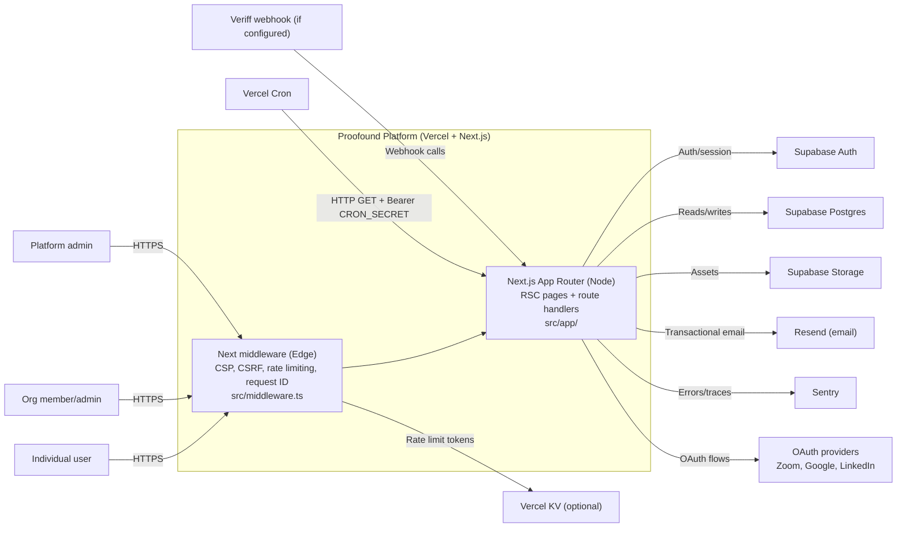
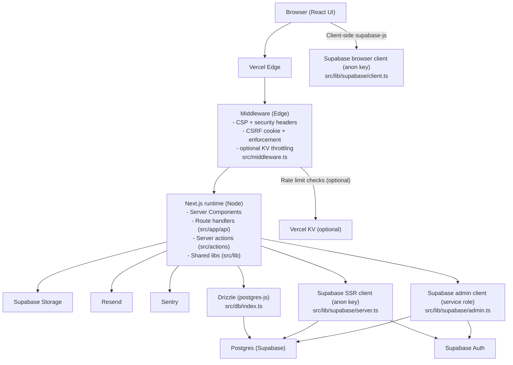

# Architecture Overview (Start Here)

This document is for:

- Engineers onboarding to the codebase
- Reviewers evaluating architecture, privacy/security posture, and operational risk

## Repo Truth Convention

- Source of truth is the repository. When this doc makes a claim, it points at concrete paths (for example `src/middleware.ts`).
- Anything explicitly labeled **Inference** is a best-effort interpretation that should be verified against code and DB policy.

## Stack (High Signal)

- Web app: Next.js App Router + React + TypeScript (`package.json`, `src/app/`).
- Edge controls: CSP/security headers, CSRF protection, request IDs, and optional rate limiting (`src/middleware.ts`, `next.config.js`).
- Auth/session: Supabase SSR client + `profiles` lookup (`src/lib/supabase/server.ts`, `src/lib/auth.ts`).
- Data layer (two patterns):
  - Drizzle + `postgres` (direct Postgres connection) for many server routes (`src/db/index.ts`, `src/db/schema.ts`).
  - Supabase clients (SSR/browser/admin) for auth and some reads/writes (`src/lib/supabase/*`).
- Email: Resend + React Email templates (`src/lib/email/*`, `emails/*`).
- Observability: Sentry Next.js integration (`next.config.js`, `sentry.*.config.ts`).
- Cron: Vercel Cron triggers a subset of `/api/cron/*` (`vercel.json`, `src/app/api/cron/*`).

## System Context (C4-ish)

## Containers (C4-ish)

## Runtime Boundaries

- Edge:
  - `src/middleware.ts` runs at the edge for all matched routes.
- Node:
  - Most route handlers under `src/app/api/*` run in the Node runtime by default.
  - Some routes explicitly set `export const runtime = 'nodejs'` (for example `src/app/api/cron/account-deletion-workflow/route.ts`).
- How to verify:
  - Check each route handler for `export const runtime = ...` and for Node-only dependencies.

## Data Access Model (Important)

There are two common data access patterns:

1. Supabase clients (RLS-oriented):
   - Server: `src/lib/supabase/server.ts` (SSR client, anon key, cookie-based session).
   - Browser: `src/lib/supabase/client.ts` (browser client, anon key).
   - Admin: `src/lib/supabase/admin.ts` (service role, bypasses RLS).

2. Drizzle direct Postgres (app-enforced authorization):
   - DB connection is created in `src/db/index.ts` from `DATABASE_URL`.
   - Many API routes and server pages query via `db` directly and enforce access checks in code (for example org membership checks in `src/app/api/match/assignment/route.ts`).

**Inference:** Supabase RLS policies apply reliably when using Supabase PostgREST or RPC with JWT context. Direct Postgres connections do not automatically carry Supabase JWT claims, so do not assume RLS is enforcing user scoping for Drizzle queries. Treat Drizzle paths as "authorization in application code" unless explicitly proven otherwise.

## Security And Privacy Overview

### Headers and CSP

- `next.config.js` defines security headers, including a CSP.
- `src/middleware.ts` also sets a CSP and other security headers.

Risk: two CSP sources can drift or conflict. See "Risks" below.

### CSRF Protection

- CSRF utilities: `src/lib/csrf.ts` (double-submit cookie pattern).
- Enforcement and token cookie setting: `src/middleware.ts`.
- Allowlist behavior:
  - Webhook and cron routes are exempted in `src/lib/csrf.ts`.
  - Many internal API route prefixes are exempted when a Supabase session cookie is present (`src/lib/csrf.ts`).

### Cron Authentication

- Vercel cron schedule: `vercel.json`.
- Cron routes verify a Bearer token:
  - Example: `src/app/api/cron/account-deletion-workflow/route.ts`
  - Example: `src/app/api/cron/decision-reminders/route.ts`

### Service Role Usage

- Admin client creation: `src/lib/supabase/admin.ts`.
- Service role is also used as an internal Bearer token for some matching refresh flows:
  - `src/app/api/core/matching/profile/route.ts`
  - `src/app/api/cron/refresh-matches/route.ts`

## Evaluation Snapshot

### Strengths

- Clear separation of concerns at the folder level (`src/app/`, `src/lib/`, `src/db/`, `src/actions/`).
- Multiple verification layers: unit tests + E2E + privacy tests exist in scripts (`package.json`, `e2e/`, `tests/privacy/`).
- Explicit operational surfaces (cron routes, health checks, deployment checklists) are present (`src/app/api/cron/*`, `src/app/api/health/route.ts`, `docs/*`).

### Risks (With Evidence + Mitigations)

1. Dual data access model can cause security drift (RLS vs app checks).
   - Evidence: `src/db/index.ts`, `src/lib/supabase/server.ts`, `src/db/policies.sql`.
   - Mitigation: document a per-route rule (Supabase client vs Drizzle), add tests around sensitive reads, and avoid mixing patterns within one flow.

2. CSP duplication can drift or break features.
   - Evidence: `next.config.js`, `src/middleware.ts`.
   - Mitigation: centralize CSP generation and apply in one place, or enforce a single source with tests.

3. Service-role key used as an internal Bearer token increases blast radius if leaked.
   - Evidence: `src/app/api/core/matching/profile/route.ts`, `src/app/api/cron/refresh-matches/route.ts`.
   - Mitigation: keep it server-only, never log it, and consider a dedicated internal token separate from Supabase service role.

4. Cron endpoint surface is larger than scheduled surface.
   - Evidence: `vercel.json`, `src/app/api/cron/*`.
   - Mitigation: standardize cron auth in a shared helper and ensure every cron route verifies `CRON_SECRET`.

5. Semantic embedding update functions exist but are not referenced elsewhere.
   - Evidence: `src/lib/matching/semantic.ts`.
   - Mitigation: wire embedding updates into profile and assignment update flows, or add a dedicated cron job for embedding refresh.

6. Mock mode can mask misconfiguration if enabled outside dev/test.
   - Evidence: `src/db/index.ts`, `src/lib/supabase/server.ts`, `src/lib/supabase/client.ts`.
   - Mitigation: ensure mock flags are blocked or loudly rejected in production environments.

7. Environment readiness check is warning-only at build time.
   - Evidence: `package.json` (`prebuild` uses `|| true`), `scripts/check-deploy-readiness.mjs`.
   - Mitigation: make readiness check blocking in CI and production builds once stable.

8. Privacy controls appear in multiple representations (JSONB and dedicated tables).
   - Evidence: `src/db/schema.ts` (`individual_profiles.field_visibility`, `profile_field_visibility`).
   - Mitigation: declare the canonical mechanism and remove or quarantine legacy paths.

### Recommended Next Steps (Top 5)

1. Write down the canonical data-access rule: when to use Supabase client vs Drizzle.
2. Consolidate CSP logic so only one implementation is authoritative.
3. Create a shared `requireCronAuth()` helper and apply it across all cron endpoints.
4. Wire semantic embedding updates into real write paths (or schedule a refresh job).
5. Tighten deploy readiness checks (fail CI) once environment setup is stable.

## Where To Go Next

- Key flows (sequence diagrams): `docs/architecture/key-flows.md`
- Core data model (ERD): `docs/architecture/data-model.md`
- Environment and ops: `docs/ENV_VARIABLES.md`, `docs/deployment-guide.md`, `docs/CRON_SETUP.md`
