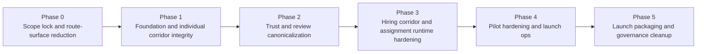

> Doc Class: `active`
> Last Verified: `2026-05-19`

# Proofound Backlog Dependency Map

## Current execution status

- `Phase 0`: resolved for route-surface truth in the 2026-05-19 sweep
- `Phase 1`: resolved for proof-first onboarding, Proof Pack anchor integrity, and export/delete/auditability in the 2026-05-19 sweep; gated narrative-surface disposition remains non-blocking
- `Phase 2`: resolved for current canonical verification token transport, launch-client verification dependence, and trust/review rechecks in the 2026-05-19 sweep
- `Phase 3`: planned/watch, with assignment runtime performance kept as a non-blocking watch item unless fresh evidence proves instability
- `Phase 4`: planned for production-candidate launch ops evidence
- `Phase 5`: planned for final packaging and governance cleanup

## Phase-level dependency graph

## Critical path

1. `P0-1` -> `P0-2` -> `P0-3`
2. `P1-1`, `P1-2`, and `P1-3` may run in parallel after Phase 0 passes; `P1-4` waits for them
3. `P2-1`, `P2-2`, and `P2-3` are resolved for the current sweep; reopen Phase 2 only if old request-table transport returns to active launch code
4. `P3-1` -> `P3-2` -> `P3-3`
5. `P4-1` -> `P4-2` and `P4-3`
6. `P5-1` -> `P5-2` -> `P5-3`

## Gate rules

- Do not reopen Phase 0 or Phase 1 unless fresh evidence regresses their 2026-05-19 `PASS` rows.
- Do not start compatibility cleanup that can affect trust/review behavior without rerunning the relevant Phase 2 checks.
- Do not refresh launch ops in Phase 4 until the narrowed corridor and assignment runtime are stable in Phase 3.
- Do not treat Phase 5 copy or governance work as a reason to defer route-surface reduction or fresh functional verification.

## Dependency hotspots

- Route-surface reduction unlocks nearly every later task because it sets the kept corridor and determines which evidence still matters.
- Export, delete, auditability, and Proof Pack anchor integrity must be freshly green before verification compatibility cleanup, otherwise Phase 2 risks masking unresolved foundation drift.
- Assignment publish performance should be profiled only on the kept corridor, not on the pre-reduction route surface.
- Runbook evidence should be refreshed only after corridor behavior and scope are stable, otherwise the evidence goes stale during the next narrowing pass.
